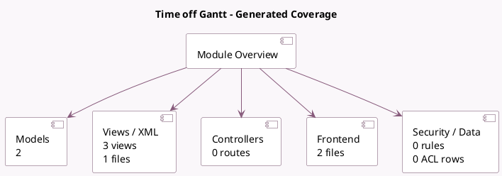

<!-- GENERATED:MODULE -->
---
tags: [odoo, enterprise, module]
---

# Time off Gantt

- Scope: Enterprise Addons
- Source: enterprise/hr_holidays_gantt
- Dependencies: [[docs/Community Addons/hr_holidays/hr_holidays|hr_holidays]], [[docs/Enterprise Addons/hr_gantt/hr_gantt|hr_gantt]]

## Summary

Gantt view for Time Off Dashboard

## Generated coverage

- Models: 2
- XML files with UI/data artifacts: 1
- Views: 3
- Actions: 2
- Menus: 0
- Rules (ir.rule): 0
- Access CSV entries: 0
- Controller units: 0
- Frontend asset files: 2

## Module map

## Detail notes

- Models: [[docs/Enterprise Addons/hr_holidays_gantt/Models|Models]] (2)
- Views and XML: [[docs/Enterprise Addons/hr_holidays_gantt/Views|Views]] (1 files)
- Frontend: [[docs/Enterprise Addons/hr_holidays_gantt/Frontend|Frontend]] (2 files)

## Key models

- `hr.leave`
- `hr.leave.report.calendar`

## Navigation

- [[../Enterprise Addons/Enterprise Addons|Back to scope]]
- [[../../docs/docs|Back to docs]]

<!-- GENERATED:MODULE -->

