<!-- GENERATED:MODEL -->
---
tags: [odoo, enterprise, generated, model]
---

# hr.employee

- Module: [[docs/Enterprise Addons/hr_payroll/hr_payroll|hr_payroll]]
- Scope: Enterprise Addons
- Defined in module: extension only
- Source files: `models/hr_employee.py`
- Python classes: `HrEmployee`
- Description: Employee

## Field footprint

- Detected fields: 33
- Field types: `Binary` x 3, `Boolean` x 6, `Char` x 1, `Date` x 5, `Float` x 1, `Integer` x 3, `Many2many` x 1, `Many2one` x 4, `Monetary` x 4, `One2many` x 1, `Properties` x 1, `Selection` x 3
- Relation fields: 6

## Sample fields

- `contract_date_end`: `Date` (related `version_id.contract_date_end`)
- `contract_date_start`: `Date` (related `version_id.contract_date_start`)
- `contract_type_id`: `Many2one` (related `version_id.contract_type_id`, store `True`)
- `contract_wage`: `Monetary` (related `version_id.contract_wage`)
- `currency_id`: `Many2one` (comodel `res.currency`, related `company_id.currency_id`)
- `date_end`: `Date` (related `version_id.date_end`)
- `date_start`: `Date` (related `version_id.date_start`)
- `disabled`: `Boolean` (related `version_id.disabled`)
- `hourly_wage`: `Monetary` (related `version_id.hourly_wage`)
- `internet_invoice`: `Binary`
- `is_current`: `Boolean` (related `version_id.is_current`)
- `is_future`: `Boolean` (related `version_id.is_future`)
- `is_in_contract`: `Boolean` (related `version_id.is_in_contract`)
- `is_past`: `Boolean` (related `version_id.is_past`)
- `mobile_invoice`: `Binary`
- `monthly_running_attachments`: `Monetary` (compute `_compute_monthly_running_attachments`)
- `payroll_properties`: `Properties` (related `version_id.payroll_properties`)
- `payslip_count`: `Integer` (compute `_compute_payslip_count`)
- `payslips_count`: `Integer` (related `version_id.payslips_count`)
- `registration_number`: `Char` (comodel `Employee Reference`)

## Method hints

- Detected methods: 9
- Action methods: `action_configure_employee_inputs`, `action_open_payslips`, `action_open_salary_attachments`
- Compute methods: `_compute_monthly_running_attachments`, `_compute_payslip_count`, `_compute_salary_attachment_count`
- Onchange methods: none

## Direct relation diagram

```plantuml
@startuml
!define ODOO_COLOR_PRIMARY #714B67
!define ODOO_COLOR_ACCENT #875A7B
!define ODOO_COLOR_BG #FAF7FA

skinparam backgroundColor ODOO_COLOR_BG
skinparam defaultTextAlignment left
skinparam ArrowColor ODOO_COLOR_ACCENT
skinparam ClassBackgroundColor white
skinparam ClassBorderColor ODOO_COLOR_PRIMARY
skinparam ComponentBackgroundColor white
skinparam ComponentBorderColor ODOO_COLOR_PRIMARY
skinparam NoteBackgroundColor #FFF8FF
skinparam NoteBorderColor ODOO_COLOR_ACCENT
skinparam SequenceLifeLineBorderColor ODOO_COLOR_ACCENT
skinparam SequenceLifeLineBackgroundColor #FFFFFF
skinparam SequenceParticipantBorderColor ODOO_COLOR_PRIMARY
skinparam SequenceParticipantBackgroundColor #FFFFFF
skinparam sequence {
  ArrowColor ODOO_COLOR_ACCENT
  ActorBorderColor ODOO_COLOR_PRIMARY
}
title hr.employee - Direct Relations
class "hr.employee" as hr_employee
class "hr.payslip" as hr_payslip
class "hr.salary.attachment" as hr_salary_attachment
class "res.currency" as res_currency
hr_employee --> res_currency : currency_id
hr_employee --|> hr_payslip : slip_ids
hr_employee .. hr_salary_attachment : salary_attachment_ids
@enduml
```

## Navigation

- **Parent:** [[docs/Enterprise Addons/hr_payroll/Models]]

<!-- GENERATED:MODEL -->
