<!-- GENERATED:MODEL -->
---
tags: [odoo, enterprise, generated, model]
---

# hr.payroll.declaration.mixin

- Module: [[docs/Enterprise Addons/hr_payroll/hr_payroll|hr_payroll]]
- Scope: Enterprise Addons
- Defined in module: yes
- Source files: `models/hr_payroll_declaration_mixin.py`
- Python classes: `HrPayrollDeclarationMixin`
- Description: Payroll Declaration Mixin

## Field footprint

- Detected fields: 6
- Field types: `Datetime` x 1, `Integer` x 1, `Many2one` x 1, `One2many` x 1, `Selection` x 1, `Text` x 1
- Relation fields: 2

## Sample fields

- `company_id`: `Many2one` (comodel `res.company`)
- `create_date`: `Datetime`
- `line_ids`: `One2many` (comodel `hr.payroll.employee.declaration`)
- `lines_count`: `Integer` (compute `_compute_lines_count`)
- `pdf_error`: `Text` (comodel `PDF Error Message`)
- `year`: `Selection`

## Method hints

- Detected methods: 13
- Action methods: `action_generate_declarations`, `action_generate_pdf`, `action_open_declarations`
- Compute methods: `_compute_lines_count`
- Onchange methods: none

## Direct relation diagram

```plantuml
@startuml
!define ODOO_COLOR_PRIMARY #714B67
!define ODOO_COLOR_ACCENT #875A7B
!define ODOO_COLOR_BG #FAF7FA

skinparam backgroundColor ODOO_COLOR_BG
skinparam defaultTextAlignment left
skinparam ArrowColor ODOO_COLOR_ACCENT
skinparam ClassBackgroundColor white
skinparam ClassBorderColor ODOO_COLOR_PRIMARY
skinparam ComponentBackgroundColor white
skinparam ComponentBorderColor ODOO_COLOR_PRIMARY
skinparam NoteBackgroundColor #FFF8FF
skinparam NoteBorderColor ODOO_COLOR_ACCENT
skinparam SequenceLifeLineBorderColor ODOO_COLOR_ACCENT
skinparam SequenceLifeLineBackgroundColor #FFFFFF
skinparam SequenceParticipantBorderColor ODOO_COLOR_PRIMARY
skinparam SequenceParticipantBackgroundColor #FFFFFF
skinparam sequence {
  ArrowColor ODOO_COLOR_ACCENT
  ActorBorderColor ODOO_COLOR_PRIMARY
}
title hr.payroll.declaration.mixin - Direct Relations
class "hr.payroll.declaration.mixin" as hr_payroll_declaration_mixin
class "hr.payroll.employee.declaration" as hr_payroll_employee_declaration
class "res.company" as res_company
hr_payroll_declaration_mixin --|> hr_payroll_employee_declaration : line_ids
hr_payroll_declaration_mixin --> res_company : company_id
@enduml
```

## Navigation

- **Parent:** [[docs/Enterprise Addons/hr_payroll/Models]]

<!-- GENERATED:MODEL -->
