<!-- GENERATED:MODEL -->
---
tags: [odoo, enterprise, generated, model]
---

# hr.payroll.edit.payslip.line

- Module: [[docs/Enterprise Addons/hr_payroll/hr_payroll|hr_payroll]]
- Scope: Enterprise Addons
- Defined in module: yes
- Source files: `wizard/hr_payroll_edit_payslip_lines_wizard.py`
- Python classes: `HrPayrollEditPayslipLine`
- Description: Edit payslip lines wizard line

## Field footprint

- Detected fields: 15
- Field types: `Char` x 2, `Float` x 5, `Integer` x 1, `Many2one` x 7
- Relation fields: 7

## Sample fields

- `amount`: `Float`
- `category_id`: `Many2one` (related `salary_rule_id.category_id`)
- `code`: `Char` (related `salary_rule_id.code`)
- `edit_payslip_lines_wizard_id`: `Many2one` (comodel `hr.payroll.edit.payslip.lines.wizard`)
- `employee_id`: `Many2one` (related `version_id.employee_id`)
- `name`: `Char`
- `quantity`: `Float`
- `rate`: `Float`
- `salary_rule_id`: `Many2one` (comodel `hr.salary.rule`)
- `sequence`: `Integer` (comodel `Sequence`)
- `slip_id`: `Many2one` (related `edit_payslip_lines_wizard_id.payslip_id`)
- `struct_id`: `Many2one` (related `slip_id.struct_id`)
- `total`: `Float` (compute `_compute_total`, store `True`)
- `version_id`: `Many2one` (related `slip_id.version_id`)
- `ytd`: `Float`

## Method hints

- Detected methods: 2
- Action methods: none
- Compute methods: `_compute_total`
- Onchange methods: none

## Direct relation diagram

```plantuml
@startuml
!define ODOO_COLOR_PRIMARY #714B67
!define ODOO_COLOR_ACCENT #875A7B
!define ODOO_COLOR_BG #FAF7FA

skinparam backgroundColor ODOO_COLOR_BG
skinparam defaultTextAlignment left
skinparam ArrowColor ODOO_COLOR_ACCENT
skinparam ClassBackgroundColor white
skinparam ClassBorderColor ODOO_COLOR_PRIMARY
skinparam ComponentBackgroundColor white
skinparam ComponentBorderColor ODOO_COLOR_PRIMARY
skinparam NoteBackgroundColor #FFF8FF
skinparam NoteBorderColor ODOO_COLOR_ACCENT
skinparam SequenceLifeLineBorderColor ODOO_COLOR_ACCENT
skinparam SequenceLifeLineBackgroundColor #FFFFFF
skinparam SequenceParticipantBorderColor ODOO_COLOR_PRIMARY
skinparam SequenceParticipantBackgroundColor #FFFFFF
skinparam sequence {
  ArrowColor ODOO_COLOR_ACCENT
  ActorBorderColor ODOO_COLOR_PRIMARY
}
title hr.payroll.edit.payslip.line - Direct Relations
class "hr.payroll.edit.payslip.line" as hr_payroll_edit_payslip_line
class "hr.payroll.edit.payslip.lines.wizard" as hr_payroll_edit_payslip_lines_wizard
class "hr.salary.rule" as hr_salary_rule
hr_payroll_edit_payslip_line --> hr_salary_rule : salary_rule_id
hr_payroll_edit_payslip_line --> hr_payroll_edit_payslip_lines_wizard : edit_payslip_lines_wizard_id
@enduml
```

## Navigation

- **Parent:** [[docs/Enterprise Addons/hr_payroll/Models]]

<!-- GENERATED:MODEL -->
