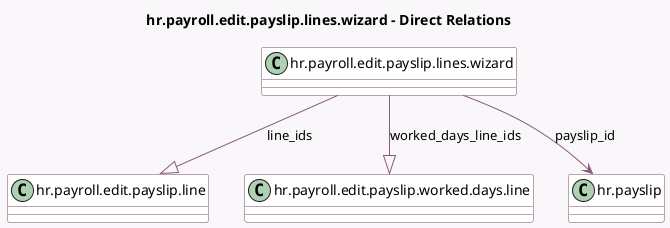

<!-- GENERATED:MODEL -->
---
tags: [odoo, enterprise, generated, model]
---

# hr.payroll.edit.payslip.lines.wizard

- Module: [[docs/Enterprise Addons/hr_payroll/hr_payroll|hr_payroll]]
- Scope: Enterprise Addons
- Defined in module: yes
- Source files: `wizard/hr_payroll_edit_payslip_lines_wizard.py`
- Python classes: `HrPayrollEditPayslipLinesWizard`
- Description: Edit payslip lines wizard

## Field footprint

- Detected fields: 4
- Field types: `Boolean` x 1, `Many2one` x 1, `One2many` x 2
- Relation fields: 3

## Sample fields

- `line_ids`: `One2many` (comodel `hr.payroll.edit.payslip.line`)
- `payslip_id`: `Many2one` (comodel `hr.payslip`)
- `worked_days_line_ids`: `One2many` (comodel `hr.payroll.edit.payslip.worked.days.line`)
- `ytd_computation`: `Boolean` (related `payslip_id.ytd_computation`)

## Method hints

- Detected methods: 4
- Action methods: `action_validate_edition`
- Compute methods: none
- Onchange methods: none

## Direct relation diagram

## Navigation

- **Parent:** [[docs/Enterprise Addons/hr_payroll/Models]]

<!-- GENERATED:MODEL -->
