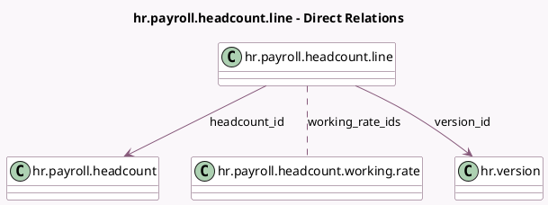

<!-- GENERATED:MODEL -->
---
tags: [odoo, enterprise, generated, model]
---

# hr.payroll.headcount.line

- Module: [[docs/Enterprise Addons/hr_payroll/hr_payroll|hr_payroll]]
- Scope: Enterprise Addons
- Defined in module: yes
- Source files: `models/hr_payroll_headcount.py`
- Python classes: `HrPayrollHeadcountLine`
- Description: Headcount Line

## Field footprint

- Detected fields: 10
- Field types: `Char` x 1, `Many2many` x 1, `Many2one` x 6, `Monetary` x 1, `Selection` x 1
- Relation fields: 7

## Sample fields

- `currency_id`: `Many2one` (related `version_id.currency_id`)
- `department_id`: `Many2one` (related `version_id.department_id`)
- `employee_id`: `Many2one` (related `version_id.employee_id`)
- `employee_type`: `Selection` (related `version_id.employee_type`)
- `headcount_id`: `Many2one` (comodel `hr.payroll.headcount`)
- `job_id`: `Many2one` (related `version_id.job_id`)
- `version_id`: `Many2one` (comodel `hr.version`)
- `version_names`: `Char`
- `wage_on_payroll`: `Monetary` (compute `_compute_wage_on_payroll`)
- `working_rate_ids`: `Many2many` (comodel `hr.payroll.headcount.working.rate`)

## Method hints

- Detected methods: 1
- Action methods: none
- Compute methods: `_compute_wage_on_payroll`
- Onchange methods: none

## Direct relation diagram

## Navigation

- **Parent:** [[docs/Enterprise Addons/hr_payroll/Models]]

<!-- GENERATED:MODEL -->
