<!-- GENERATED:MODEL -->
---
tags: [odoo, enterprise, generated, model]
---

# hr.payroll.headcount

- Module: [[docs/Enterprise Addons/hr_payroll/hr_payroll|hr_payroll]]
- Scope: Enterprise Addons
- Defined in module: yes
- Source files: `models/hr_payroll_headcount.py`
- Python classes: `HrPayrollHeadcount`
- Description: Payroll Headcount

## Field footprint

- Detected fields: 7
- Field types: `Boolean` x 1, `Char` x 1, `Date` x 2, `Integer` x 1, `Many2one` x 1, `One2many` x 1
- Relation fields: 2

## Sample fields

- `company_id`: `Many2one` (comodel `res.company`)
- `date_from`: `Date`
- `date_to`: `Date`
- `employee_count`: `Integer`
- `is_name_custom`: `Boolean` (compute `_compute_is_name_custom`)
- `line_ids`: `One2many` (comodel `hr.payroll.headcount.line`)
- `name`: `Char` (compute `_compute_name`, store `True`)

## Method hints

- Detected methods: 5
- Action methods: `action_open_lines`, `action_populate`
- Compute methods: `_compute_is_name_custom`, `_compute_name`
- Onchange methods: none

## Direct relation diagram

```plantuml
@startuml
!define ODOO_COLOR_PRIMARY #714B67
!define ODOO_COLOR_ACCENT #875A7B
!define ODOO_COLOR_BG #FAF7FA

skinparam backgroundColor ODOO_COLOR_BG
skinparam defaultTextAlignment left
skinparam ArrowColor ODOO_COLOR_ACCENT
skinparam ClassBackgroundColor white
skinparam ClassBorderColor ODOO_COLOR_PRIMARY
skinparam ComponentBackgroundColor white
skinparam ComponentBorderColor ODOO_COLOR_PRIMARY
skinparam NoteBackgroundColor #FFF8FF
skinparam NoteBorderColor ODOO_COLOR_ACCENT
skinparam SequenceLifeLineBorderColor ODOO_COLOR_ACCENT
skinparam SequenceLifeLineBackgroundColor #FFFFFF
skinparam SequenceParticipantBorderColor ODOO_COLOR_PRIMARY
skinparam SequenceParticipantBackgroundColor #FFFFFF
skinparam sequence {
  ArrowColor ODOO_COLOR_ACCENT
  ActorBorderColor ODOO_COLOR_PRIMARY
}
title hr.payroll.headcount - Direct Relations
class "hr.payroll.headcount" as hr_payroll_headcount
class "hr.payroll.headcount.line" as hr_payroll_headcount_line
class "res.company" as res_company
hr_payroll_headcount --> res_company : company_id
hr_payroll_headcount --|> hr_payroll_headcount_line : line_ids
@enduml
```

## Navigation

- **Parent:** [[docs/Enterprise Addons/hr_payroll/Models]]

<!-- GENERATED:MODEL -->
