<!-- GENERATED:MODEL -->
---
tags: [odoo, enterprise, generated, model]
---

# hr.payroll.index

- Module: [[docs/Enterprise Addons/hr_payroll/hr_payroll|hr_payroll]]
- Scope: Enterprise Addons
- Defined in module: yes
- Source files: `wizard/hr_payroll_index_wizard.py`
- Python classes: `HrPayrollIndex`
- Description: Index contracts

## Field footprint

- Detected fields: 6
- Field types: `Char` x 1, `Float` x 1, `Html` x 1, `Many2many` x 3
- Relation fields: 3

## Sample fields

- `affected_version_ids`: `Many2many` (comodel `hr.version`, compute `_compute_affected_version_ids`)
- `description`: `Char` (comodel `Description`, compute `_compute_description`, store `True`)
- `employee_ids`: `Many2many` (comodel `hr.employee`)
- `informative_message`: `Html` (compute `_compute_informative_message`)
- `percentage`: `Float` (comodel `Percentage`)
- `version_ids`: `Many2many` (comodel `hr.version`, compute `_compute_version_ids`, store `True`)

## Method hints

- Detected methods: 5
- Action methods: `action_confirm`
- Compute methods: `_compute_affected_version_ids`, `_compute_description`, `_compute_informative_message`, `_compute_version_ids`
- Onchange methods: none

## Direct relation diagram

```plantuml
@startuml
!define ODOO_COLOR_PRIMARY #714B67
!define ODOO_COLOR_ACCENT #875A7B
!define ODOO_COLOR_BG #FAF7FA

skinparam backgroundColor ODOO_COLOR_BG
skinparam defaultTextAlignment left
skinparam ArrowColor ODOO_COLOR_ACCENT
skinparam ClassBackgroundColor white
skinparam ClassBorderColor ODOO_COLOR_PRIMARY
skinparam ComponentBackgroundColor white
skinparam ComponentBorderColor ODOO_COLOR_PRIMARY
skinparam NoteBackgroundColor #FFF8FF
skinparam NoteBorderColor ODOO_COLOR_ACCENT
skinparam SequenceLifeLineBorderColor ODOO_COLOR_ACCENT
skinparam SequenceLifeLineBackgroundColor #FFFFFF
skinparam SequenceParticipantBorderColor ODOO_COLOR_PRIMARY
skinparam SequenceParticipantBackgroundColor #FFFFFF
skinparam sequence {
  ArrowColor ODOO_COLOR_ACCENT
  ActorBorderColor ODOO_COLOR_PRIMARY
}
title hr.payroll.index - Direct Relations
class "hr.payroll.index" as hr_payroll_index
class "hr.employee" as hr_employee
class "hr.version" as hr_version
hr_payroll_index .. hr_employee : employee_ids
hr_payroll_index .. hr_version : version_ids
hr_payroll_index .. hr_version : affected_version_ids
@enduml
```

## Navigation

- **Parent:** [[docs/Enterprise Addons/hr_payroll/Models]]

<!-- GENERATED:MODEL -->
