<!-- GENERATED:MODEL -->
---
tags: [odoo, enterprise, generated, model]
---

# hr.payroll.payment.report.wizard

- Module: [[docs/Enterprise Addons/hr_payroll/hr_payroll|hr_payroll]]
- Scope: Enterprise Addons
- Defined in module: yes
- Source files: `wizard/hr_payroll_payment_report_wizard.py`
- Python classes: `HrPayrollPaymentReportWizard`
- Description: HR Payroll Payment Report Wizard

## Field footprint

- Detected fields: 5
- Field types: `Date` x 1, `Many2many` x 1, `Many2one` x 2, `Selection` x 1
- Relation fields: 3

## Sample fields

- `company_id`: `Many2one` (comodel `res.company`, compute `_compute_company_id`)
- `effective_date`: `Date`
- `export_format`: `Selection`
- `payslip_ids`: `Many2many` (comodel `hr.payslip`)
- `payslip_run_id`: `Many2one` (comodel `hr.payslip.run`)

## Method hints

- Detected methods: 6
- Action methods: none
- Compute methods: `_compute_company_id`
- Onchange methods: none

## Direct relation diagram

```plantuml
@startuml
!define ODOO_COLOR_PRIMARY #714B67
!define ODOO_COLOR_ACCENT #875A7B
!define ODOO_COLOR_BG #FAF7FA

skinparam backgroundColor ODOO_COLOR_BG
skinparam defaultTextAlignment left
skinparam ArrowColor ODOO_COLOR_ACCENT
skinparam ClassBackgroundColor white
skinparam ClassBorderColor ODOO_COLOR_PRIMARY
skinparam ComponentBackgroundColor white
skinparam ComponentBorderColor ODOO_COLOR_PRIMARY
skinparam NoteBackgroundColor #FFF8FF
skinparam NoteBorderColor ODOO_COLOR_ACCENT
skinparam SequenceLifeLineBorderColor ODOO_COLOR_ACCENT
skinparam SequenceLifeLineBackgroundColor #FFFFFF
skinparam SequenceParticipantBorderColor ODOO_COLOR_PRIMARY
skinparam SequenceParticipantBackgroundColor #FFFFFF
skinparam sequence {
  ArrowColor ODOO_COLOR_ACCENT
  ActorBorderColor ODOO_COLOR_PRIMARY
}
title hr.payroll.payment.report.wizard - Direct Relations
class "hr.payroll.payment.report.wizard" as hr_payroll_payment_report_wizard
class "hr.payslip" as hr_payslip
class "hr.payslip.run" as hr_payslip_run
class "res.company" as res_company
hr_payroll_payment_report_wizard --> hr_payslip_run : payslip_run_id
hr_payroll_payment_report_wizard .. hr_payslip : payslip_ids
hr_payroll_payment_report_wizard --> res_company : company_id
@enduml
```

## Navigation

- **Parent:** [[docs/Enterprise Addons/hr_payroll/Models]]

<!-- GENERATED:MODEL -->
