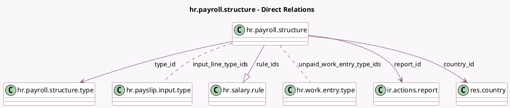

<!-- GENERATED:MODEL -->
---
tags: [odoo, enterprise, generated, model]
---

# hr.payroll.structure

- Module: [[docs/Enterprise Addons/hr_payroll/hr_payroll|hr_payroll]]
- Scope: Enterprise Addons
- Defined in module: yes
- Source files: `models/hr_payroll_structure.py`
- Python classes: `HrPayrollStructure`
- Description: Salary Structure

## Field footprint

- Detected fields: 17
- Field types: `Boolean` x 4, `Char` x 3, `Html` x 1, `Many2many` x 2, `Many2one` x 3, `One2many` x 1, `PropertiesDefinition` x 2, `Selection` x 1
- Relation fields: 6

## Sample fields

- `active`: `Boolean`
- `code`: `Char`
- `country_id`: `Many2one` (comodel `res.country`)
- `hide_basic_on_pdf`: `Boolean`
- `input_line_type_ids`: `Many2many` (comodel `hr.payslip.input.type`)
- `name`: `Char`
- `note`: `Html`
- `payslip_name`: `Char`
- `payslip_properties_definition`: `PropertiesDefinition` (comodel `Payslip Properties Definition`)
- `report_id`: `Many2one` (comodel `ir.actions.report`)
- `rule_ids`: `One2many` (comodel `hr.salary.rule`)
- `schedule_pay`: `Selection` (related `type_id.default_schedule_pay`)
- `type_id`: `Many2one` (comodel `hr.payroll.structure.type`)
- `unpaid_work_entry_type_ids`: `Many2many` (comodel `hr.work.entry.type`)
- `use_worked_day_lines`: `Boolean`
- `version_properties_definition`: `PropertiesDefinition` (comodel `Version Properties Definition`)
- `ytd_computation`: `Boolean`

## Method hints

- Detected methods: 7
- Action methods: `action_get_structure_inputs`
- Compute methods: none
- Onchange methods: none

## Direct relation diagram

## Navigation

- **Parent:** [[docs/Enterprise Addons/hr_payroll/Models]]

<!-- GENERATED:MODEL -->
