<!-- GENERATED:MODEL -->
---
tags: [odoo, enterprise, generated, model]
---

# hr.payroll.structure.type

- Module: [[docs/Enterprise Addons/hr_payroll/hr_payroll|hr_payroll]]
- Scope: Enterprise Addons
- Defined in module: extension only
- Source files: `models/hr_payroll_structure_type.py`
- Python classes: `HrPayrollStructureType`
- Description: Salary Structure Type

## Field footprint

- Detected fields: 8
- Field types: `Char` x 1, `Integer` x 2, `Many2one` x 2, `One2many` x 1, `Selection` x 2
- Relation fields: 3

## Sample fields

- `default_schedule_pay`: `Selection`
- `default_struct_id`: `Many2one` (comodel `hr.payroll.structure`)
- `default_work_entry_type_id`: `Many2one` (comodel `hr.work.entry.type`)
- `name`: `Char` (comodel `Structure Type`)
- `sequence`: `Integer`
- `struct_ids`: `One2many` (comodel `hr.payroll.structure`)
- `struct_type_count`: `Integer` (compute `_compute_struct_type_count`)
- `wage_type`: `Selection`

## Method hints

- Detected methods: 5
- Action methods: none
- Compute methods: `_compute_struct_type_count`
- Onchange methods: none

## Direct relation diagram

```plantuml
@startuml
!define ODOO_COLOR_PRIMARY #714B67
!define ODOO_COLOR_ACCENT #875A7B
!define ODOO_COLOR_BG #FAF7FA

skinparam backgroundColor ODOO_COLOR_BG
skinparam defaultTextAlignment left
skinparam ArrowColor ODOO_COLOR_ACCENT
skinparam ClassBackgroundColor white
skinparam ClassBorderColor ODOO_COLOR_PRIMARY
skinparam ComponentBackgroundColor white
skinparam ComponentBorderColor ODOO_COLOR_PRIMARY
skinparam NoteBackgroundColor #FFF8FF
skinparam NoteBorderColor ODOO_COLOR_ACCENT
skinparam SequenceLifeLineBorderColor ODOO_COLOR_ACCENT
skinparam SequenceLifeLineBackgroundColor #FFFFFF
skinparam SequenceParticipantBorderColor ODOO_COLOR_PRIMARY
skinparam SequenceParticipantBackgroundColor #FFFFFF
skinparam sequence {
  ArrowColor ODOO_COLOR_ACCENT
  ActorBorderColor ODOO_COLOR_PRIMARY
}
title hr.payroll.structure.type - Direct Relations
class "hr.payroll.structure.type" as hr_payroll_structure_type
class "hr.payroll.structure" as hr_payroll_structure
class "hr.work.entry.type" as hr_work_entry_type
hr_payroll_structure_type --|> hr_payroll_structure : struct_ids
hr_payroll_structure_type --> hr_payroll_structure : default_struct_id
hr_payroll_structure_type --> hr_work_entry_type : default_work_entry_type_id
@enduml
```

## Navigation

- **Parent:** [[docs/Enterprise Addons/hr_payroll/Models]]

<!-- GENERATED:MODEL -->
