<!-- GENERATED:MODEL -->
---
tags: [odoo, enterprise, generated, model]
---

# hr.payslip.correction.wizard

- Module: [[docs/Enterprise Addons/hr_payroll/hr_payroll|hr_payroll]]
- Scope: Enterprise Addons
- Defined in module: yes
- Source files: `wizard/hr_payslip_correction_wizard.py`
- Python classes: `HrPayslipCorrectionWizard`
- Description: Payslip Correction Wizard

## Field footprint

- Detected fields: 6
- Field types: `Boolean` x 1, `Integer` x 1, `Many2many` x 1, `Many2one` x 2, `Selection` x 1
- Relation fields: 3

## Sample fields

- `correction_choice`: `Selection`
- `employee_id`: `Many2one` (comodel `hr.employee`)
- `is_multi_payslip`: `Boolean` (compute `_compute_payslip_ids`)
- `payslip_count`: `Integer` (compute `_compute_payslip_ids`)
- `payslip_id`: `Many2one` (comodel `hr.payslip`)
- `payslip_ids`: `Many2many` (comodel `hr.payslip`, compute `_compute_payslip_ids`)

## Method hints

- Detected methods: 4
- Action methods: `action_correct_payslips`, `action_revert_payslips`, `action_show_related_payslips`
- Compute methods: `_compute_payslip_ids`
- Onchange methods: none

## Direct relation diagram

```plantuml
@startuml
!define ODOO_COLOR_PRIMARY #714B67
!define ODOO_COLOR_ACCENT #875A7B
!define ODOO_COLOR_BG #FAF7FA

skinparam backgroundColor ODOO_COLOR_BG
skinparam defaultTextAlignment left
skinparam ArrowColor ODOO_COLOR_ACCENT
skinparam ClassBackgroundColor white
skinparam ClassBorderColor ODOO_COLOR_PRIMARY
skinparam ComponentBackgroundColor white
skinparam ComponentBorderColor ODOO_COLOR_PRIMARY
skinparam NoteBackgroundColor #FFF8FF
skinparam NoteBorderColor ODOO_COLOR_ACCENT
skinparam SequenceLifeLineBorderColor ODOO_COLOR_ACCENT
skinparam SequenceLifeLineBackgroundColor #FFFFFF
skinparam SequenceParticipantBorderColor ODOO_COLOR_PRIMARY
skinparam SequenceParticipantBackgroundColor #FFFFFF
skinparam sequence {
  ArrowColor ODOO_COLOR_ACCENT
  ActorBorderColor ODOO_COLOR_PRIMARY
}
title hr.payslip.correction.wizard - Direct Relations
class "hr.payslip.correction.wizard" as hr_payslip_correction_wizard
class "hr.employee" as hr_employee
class "hr.payslip" as hr_payslip
hr_payslip_correction_wizard --> hr_employee : employee_id
hr_payslip_correction_wizard --> hr_payslip : payslip_id
hr_payslip_correction_wizard .. hr_payslip : payslip_ids
@enduml
```

## Navigation

- **Parent:** [[docs/Enterprise Addons/hr_payroll/Models]]

<!-- GENERATED:MODEL -->
