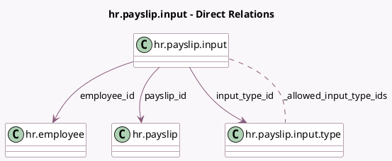

<!-- GENERATED:MODEL -->
---
tags: [odoo, enterprise, generated, model]
---

# hr.payslip.input

- Module: [[docs/Enterprise Addons/hr_payroll/hr_payroll|hr_payroll]]
- Scope: Enterprise Addons
- Defined in module: yes
- Source files: `models/hr_payslip_input.py`
- Python classes: `HrPayslipInput`
- Description: Payslip Input

## Field footprint

- Detected fields: 10
- Field types: `Char` x 2, `Date` x 1, `Float` x 1, `Integer` x 1, `Many2many` x 1, `Many2one` x 4
- Relation fields: 5

## Sample fields

- `_allowed_input_type_ids`: `Many2many` (comodel `hr.payslip.input.type`, related `payslip_id.struct_id.input_line_type_ids`)
- `amount`: `Float`
- `code`: `Char` (related `input_type_id.code`)
- `date_from`: `Date` (related `payslip_id.date_from`)
- `employee_id`: `Many2one` (comodel `hr.employee`, related `payslip_id.employee_id`)
- `input_type_id`: `Many2one` (comodel `hr.payslip.input.type`)
- `name`: `Char`
- `payslip_id`: `Many2one` (comodel `hr.payslip`)
- `sequence`: `Integer`
- `version_id`: `Many2one` (related `payslip_id.version_id`)

## Method hints

- Detected methods: 0
- Action methods: none
- Compute methods: none
- Onchange methods: none

## Direct relation diagram

## Navigation

- **Parent:** [[docs/Enterprise Addons/hr_payroll/Models]]

<!-- GENERATED:MODEL -->
