<!-- GENERATED:MODEL -->
---
tags: [odoo, enterprise, generated, model]
---

# hr.payslip.input.type

- Module: [[docs/Enterprise Addons/hr_payroll/hr_payroll|hr_payroll]]
- Scope: Enterprise Addons
- Defined in module: yes
- Source files: `models/hr_payslip_input_type.py`
- Python classes: `HrPayslipInputType`
- Description: Payslip Input Type

## Field footprint

- Detected fields: 9
- Field types: `Boolean` x 4, `Char` x 3, `Many2many` x 1, `Many2one` x 1
- Relation fields: 2

## Sample fields

- `active`: `Boolean` (comodel `Active`)
- `available_in_attachments`: `Boolean`
- `code`: `Char`
- `country_code`: `Char` (related `country_id.code`)
- `country_id`: `Many2one` (comodel `res.country`)
- `default_no_end_date`: `Boolean` (comodel `No end date by default`)
- `is_quantity`: `Boolean`
- `name`: `Char`
- `struct_ids`: `Many2many` (comodel `hr.payroll.structure`)

## Method hints

- Detected methods: 2
- Action methods: none
- Compute methods: none
- Onchange methods: none

## Direct relation diagram

```plantuml
@startuml
!define ODOO_COLOR_PRIMARY #714B67
!define ODOO_COLOR_ACCENT #875A7B
!define ODOO_COLOR_BG #FAF7FA

skinparam backgroundColor ODOO_COLOR_BG
skinparam defaultTextAlignment left
skinparam ArrowColor ODOO_COLOR_ACCENT
skinparam ClassBackgroundColor white
skinparam ClassBorderColor ODOO_COLOR_PRIMARY
skinparam ComponentBackgroundColor white
skinparam ComponentBorderColor ODOO_COLOR_PRIMARY
skinparam NoteBackgroundColor #FFF8FF
skinparam NoteBorderColor ODOO_COLOR_ACCENT
skinparam SequenceLifeLineBorderColor ODOO_COLOR_ACCENT
skinparam SequenceLifeLineBackgroundColor #FFFFFF
skinparam SequenceParticipantBorderColor ODOO_COLOR_PRIMARY
skinparam SequenceParticipantBackgroundColor #FFFFFF
skinparam sequence {
  ArrowColor ODOO_COLOR_ACCENT
  ActorBorderColor ODOO_COLOR_PRIMARY
}
title hr.payslip.input.type - Direct Relations
class "hr.payslip.input.type" as hr_payslip_input_type
class "hr.payroll.structure" as hr_payroll_structure
class "res.country" as res_country
hr_payslip_input_type .. hr_payroll_structure : struct_ids
hr_payslip_input_type --> res_country : country_id
@enduml
```

## Navigation

- **Parent:** [[docs/Enterprise Addons/hr_payroll/Models]]

<!-- GENERATED:MODEL -->
