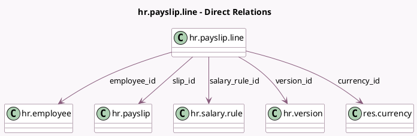

<!-- GENERATED:MODEL -->
---
tags: [odoo, enterprise, generated, model]
---

# hr.payslip.line

- Module: [[docs/Enterprise Addons/hr_payroll/hr_payroll|hr_payroll]]
- Scope: Enterprise Addons
- Defined in module: yes
- Source files: `models/hr_payslip_line.py`
- Python classes: `HrPayslipLine`
- Description: Payslip Line

## Field footprint

- Detected fields: 22
- Field types: `Boolean` x 1, `Char` x 2, `Date` x 2, `Float` x 4, `Integer` x 1, `Many2one` x 8, `Monetary` x 3, `Selection` x 1
- Relation fields: 8

## Sample fields

- `amount`: `Monetary`
- `amount_fix`: `Float` (related `salary_rule_id.amount_fix`)
- `amount_percentage`: `Float` (related `salary_rule_id.amount_percentage`)
- `amount_select`: `Selection` (related `salary_rule_id.amount_select`)
- `appears_on_payslip`: `Boolean` (related `salary_rule_id.appears_on_payslip`)
- `category_id`: `Many2one` (related `salary_rule_id.category_id`)
- `code`: `Char`
- `company_id`: `Many2one` (related `slip_id.company_id`)
- `currency_id`: `Many2one` (comodel `res.currency`, related `slip_id.currency_id`)
- `date_from`: `Date` (related `slip_id.date_from`, store `True`)
- `date_to`: `Date` (related `slip_id.date_to`, store `True`)
- `employee_id`: `Many2one` (comodel `hr.employee`)
- `name`: `Char`
- `partner_id`: `Many2one` (related `salary_rule_id.partner_id`)
- `quantity`: `Float`
- `rate`: `Float`
- `salary_rule_id`: `Many2one` (comodel `hr.salary.rule`)
- `sequence`: `Integer`
- `slip_id`: `Many2one` (comodel `hr.payslip`)
- `total`: `Monetary`

## Method hints

- Detected methods: 2
- Action methods: none
- Compute methods: none
- Onchange methods: none

## Direct relation diagram

## Navigation

- **Parent:** [[docs/Enterprise Addons/hr_payroll/Models]]

<!-- GENERATED:MODEL -->
