<!-- GENERATED:MODEL -->
---
tags: [odoo, enterprise, generated, model]
---

# hr.payslip

- Module: [[docs/Enterprise Addons/hr_payroll/hr_payroll|hr_payroll]]
- Scope: Enterprise Addons
- Defined in module: yes
- Source files: `models/hr_payslip.py`
- Python classes: `HrPayslip`
- Description: Pay Slip
- Inherits: `mail.activity.mixin`, `mail.thread.cc`, `mail.thread.main.attachment`

## Field footprint

- Detected fields: 66
- Field types: `Binary` x 1, `Boolean` x 17, `Char` x 6, `Date` x 5, `Datetime` x 1, `Float` x 2, `Image` x 4, `Integer` x 4, `Json` x 1, `Many2many` x 1, `Many2one` x 11, `Monetary` x 4, `One2many` x 4, `Properties` x 1, `Selection` x 3, `Text` x 1
- Relation fields: 16

## Sample fields

- `avatar_128`: `Image` (related `employee_id.avatar_128`)
- `avatar_1920`: `Image` (related `employee_id.avatar_1920`)
- `basic_wage`: `Monetary` (compute `_compute_basic_net`, store `True`)
- `company_id`: `Many2one` (comodel `res.company`, compute `_compute_company_id`, store `True`)
- `compute_date`: `Date` (comodel `Computed On`)
- `country_code`: `Char` (related `country_id.code`)
- `country_id`: `Many2one` (comodel `res.country`, related `company_id.country_id`)
- `credit_note`: `Boolean`
- `currency_id`: `Many2one` (related `version_id.currency_id`)
- `date_from`: `Date`
- `date_to`: `Date` (compute `_compute_date_to`, store `True`)
- `department_id`: `Many2one` (comodel `hr.department`, related `employee_id.department_id`, store `True`)
- `done_date`: `Datetime`
- `edited`: `Boolean`
- `employee_id`: `Many2one` (comodel `hr.employee`)
- `employee_reference`: `Char` (related `employee_id.registration_number`)
- `employer_cost`: `Monetary` (compute `_compute_basic_net`, store `True`)
- `error_count`: `Integer` (compute `_compute_issues`, store `True`)
- `gross_wage`: `Monetary` (compute `_compute_basic_net`, store `True`)
- `has_negative_net_to_report`: `Boolean`

## Method hints

- Detected methods: 120
- Action methods: `action_adjust_payslip`, `action_configure_payslip_inputs`, `action_draft_linked_entries`, `action_edit_payslip_lines`, `action_export_payslip`, `action_keep_wrong_version`, `action_move_to_off_cycle`, `action_open_related_payslips`, and 12 more
- Compute methods: `_compute_basic_net`, `_compute_company_id`, `_compute_date_to`, `_compute_input_line_ids`, `_compute_is_regular`, `_compute_is_superuser`, `_compute_is_wrong_duration`, `_compute_is_wrong_version`, and 14 more
- Onchange methods: none

## Direct relation diagram

```plantuml
@startuml
!define ODOO_COLOR_PRIMARY #714B67
!define ODOO_COLOR_ACCENT #875A7B
!define ODOO_COLOR_BG #FAF7FA

skinparam backgroundColor ODOO_COLOR_BG
skinparam defaultTextAlignment left
skinparam ArrowColor ODOO_COLOR_ACCENT
skinparam ClassBackgroundColor white
skinparam ClassBorderColor ODOO_COLOR_PRIMARY
skinparam ComponentBackgroundColor white
skinparam ComponentBorderColor ODOO_COLOR_PRIMARY
skinparam NoteBackgroundColor #FFF8FF
skinparam NoteBorderColor ODOO_COLOR_ACCENT
skinparam SequenceLifeLineBorderColor ODOO_COLOR_ACCENT
skinparam SequenceLifeLineBackgroundColor #FFFFFF
skinparam SequenceParticipantBorderColor ODOO_COLOR_PRIMARY
skinparam SequenceParticipantBackgroundColor #FFFFFF
skinparam sequence {
  ArrowColor ODOO_COLOR_ACCENT
  ActorBorderColor ODOO_COLOR_PRIMARY
}
title hr.payslip - Direct Relations
class "hr.payslip" as hr_payslip
class "hr.department" as hr_department
class "hr.employee" as hr_employee
class "hr.job" as hr_job
class "hr.payroll.structure" as hr_payroll_structure
class "hr.payroll.structure.type" as hr_payroll_structure_type
class "hr.payslip" as hr_payslip
class "hr.payslip.input" as hr_payslip_input
class "hr.payslip.line" as hr_payslip_line
class "hr.payslip.run" as hr_payslip_run
class "hr.payslip.worked_days" as hr_payslip_worked_days
class "hr.salary.attachment" as hr_salary_attachment
class "hr.version" as hr_version
hr_payslip --> hr_payroll_structure : struct_id
hr_payslip --> hr_payroll_structure_type : struct_type_id
hr_payslip --> hr_employee : employee_id
hr_payslip --> hr_department : department_id
hr_payslip --> hr_job : job_id
hr_payslip --|> hr_payslip_line : line_ids
hr_payslip --> res_company : company_id
hr_payslip --> res_country : country_id
hr_payslip --|> hr_payslip_worked_days : worked_days_line_ids
hr_payslip --|> hr_payslip_input : input_line_ids
hr_payslip --> hr_version : version_id
hr_payslip --> hr_payslip_run : payslip_run_id
hr_payslip .. hr_salary_attachment : salary_attachment_ids
hr_payslip --> hr_payslip : origin_payslip_id
hr_payslip --|> hr_payslip : related_payslip_ids
@enduml
```

## Navigation

- **Parent:** [[docs/Enterprise Addons/hr_payroll/Models]]

<!-- GENERATED:MODEL -->
