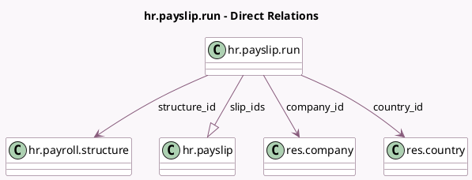

<!-- GENERATED:MODEL -->
---
tags: [odoo, enterprise, generated, model]
---

# hr.payslip.run

- Module: [[docs/Enterprise Addons/hr_payroll/hr_payroll|hr_payroll]]
- Scope: Enterprise Addons
- Defined in module: yes
- Source files: `models/hr_payslip_run.py`
- Python classes: `HrPayslipRun`
- Description: Pay Run
- Inherits: `mail.activity.mixin`, `mail.thread`

## Field footprint

- Detected fields: 25
- Field types: `Binary` x 1, `Boolean` x 3, `Char` x 4, `Date` x 3, `Integer` x 4, `Many2one` x 4, `Monetary` x 3, `One2many` x 1, `Selection` x 2
- Relation fields: 5

## Sample fields

- `active`: `Boolean`
- `color`: `Integer` (compute `_compute_color`)
- `company_id`: `Many2one` (comodel `res.company`)
- `country_code`: `Char` (related `country_id.code`)
- `country_id`: `Many2one` (comodel `res.country`, related `company_id.country_id`)
- `currency_id`: `Many2one` (related `company_id.currency_id`)
- `date_end`: `Date` (compute `_compute_date_end`, store `True`)
- `date_start`: `Date` (compute `_compute_date_start`, store `True`)
- `empty_payslips`: `Integer` (compute `_compute_empty_payslips`)
- `gross_sum`: `Monetary` (compute `_compute_gross_net_sum`, store `True`)
- `has_error`: `Boolean` (compute `_compute_has_error`)
- `name`: `Char`
- `net_sum`: `Monetary` (compute `_compute_gross_net_sum`, store `True`)
- `payment_report`: `Binary`
- `payment_report_date`: `Date`
- `payment_report_filename`: `Char`
- `payment_report_format`: `Char`
- `payslip_count`: `Integer` (compute `_compute_payslip_count`, store `True`)
- `payslips_with_issues`: `Integer` (compute `_compute_payslips_with_issues`)
- `schedule_pay`: `Selection` (compute `_compute_schedule_pay`, store `True`)

## Method hints

- Detected methods: 28
- Action methods: `action_confirm`, `action_draft`, `action_open_payslips`, `action_paid`, `action_payment_report`, `action_payroll_hr_version_list_view_payrun`, `action_review_issues`, `action_unpaid`, and 1 more
- Compute methods: `_compute_color`, `_compute_date_end`, `_compute_date_start`, `_compute_empty_payslips`, `_compute_gross_net_sum`, `_compute_has_error`, `_compute_payslip_count`, `_compute_payslips_with_issues`, and 3 more
- Onchange methods: none

## Direct relation diagram

## Navigation

- **Parent:** [[docs/Enterprise Addons/hr_payroll/Models]]

<!-- GENERATED:MODEL -->
