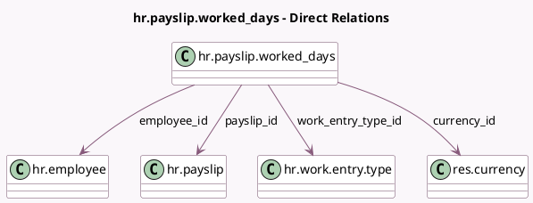

<!-- GENERATED:MODEL -->
---
tags: [odoo, enterprise, generated, model]
---

# hr.payslip.worked_days

- Module: [[docs/Enterprise Addons/hr_payroll/hr_payroll|hr_payroll]]
- Scope: Enterprise Addons
- Defined in module: yes
- Source files: `models/hr_payslip_worked_days.py`
- Python classes: `HrPayslipWorkedDays`
- Description: Payslip Worked Days

## Field footprint

- Detected fields: 14
- Field types: `Boolean` x 1, `Char` x 2, `Date` x 1, `Float` x 2, `Integer` x 1, `Many2one` x 5, `Monetary` x 2
- Relation fields: 5

## Sample fields

- `amount`: `Monetary` (compute `_compute_amount`, store `True`)
- `code`: `Char` (related `work_entry_type_id.code`)
- `currency_id`: `Many2one` (comodel `res.currency`, related `payslip_id.currency_id`)
- `date_from`: `Date` (related `payslip_id.date_from`, store `True`)
- `employee_id`: `Many2one` (comodel `hr.employee`, related `payslip_id.employee_id`, store `True`)
- `is_paid`: `Boolean` (compute `_compute_is_paid`, store `True`)
- `name`: `Char` (compute `_compute_name`, store `True`)
- `number_of_days`: `Float`
- `number_of_hours`: `Float`
- `payslip_id`: `Many2one` (comodel `hr.payslip`)
- `sequence`: `Integer`
- `version_id`: `Many2one` (related `payslip_id.version_id`)
- `work_entry_type_id`: `Many2one` (comodel `hr.work.entry.type`)
- `ytd`: `Monetary`

## Method hints

- Detected methods: 4
- Action methods: none
- Compute methods: `_compute_amount`, `_compute_is_paid`, `_compute_name`
- Onchange methods: none

## Direct relation diagram

## Navigation

- **Parent:** [[docs/Enterprise Addons/hr_payroll/Models]]

<!-- GENERATED:MODEL -->
