<!-- GENERATED:MODEL -->
---
tags: [odoo, enterprise, generated, model]
---

# hr.rule.parameter

- Module: [[docs/Enterprise Addons/hr_payroll/hr_payroll|hr_payroll]]
- Scope: Enterprise Addons
- Defined in module: yes
- Source files: `models/hr_rule_parameter.py`
- Python classes: `HrRuleParameter`
- Description: Salary Rule Parameter

## Field footprint

- Detected fields: 9
- Field types: `Char` x 2, `Date` x 1, `Html` x 1, `Integer` x 1, `Many2one` x 1, `One2many` x 2, `Text` x 1
- Relation fields: 3

## Sample fields

- `code`: `Char`
- `country_id`: `Many2one` (comodel `res.country`)
- `current_value_one_line`: `Text` (compute `_compute_current_value`)
- `description`: `Html`
- `name`: `Char`
- `parameter_version_ids`: `One2many` (comodel `hr.rule.parameter.value`)
- `salary_rule_count`: `Integer` (compute `_compute_salary_rule`)
- `salary_rule_ids`: `One2many` (comodel `hr.salary.rule`, compute `_compute_salary_rule`)
- `valid_since`: `Date` (compute `_compute_current_value`)

## Method hints

- Detected methods: 4
- Action methods: `action_open_salary_rules`
- Compute methods: `_compute_current_value`, `_compute_salary_rule`
- Onchange methods: none

## Direct relation diagram

```plantuml
@startuml
!define ODOO_COLOR_PRIMARY #714B67
!define ODOO_COLOR_ACCENT #875A7B
!define ODOO_COLOR_BG #FAF7FA

skinparam backgroundColor ODOO_COLOR_BG
skinparam defaultTextAlignment left
skinparam ArrowColor ODOO_COLOR_ACCENT
skinparam ClassBackgroundColor white
skinparam ClassBorderColor ODOO_COLOR_PRIMARY
skinparam ComponentBackgroundColor white
skinparam ComponentBorderColor ODOO_COLOR_PRIMARY
skinparam NoteBackgroundColor #FFF8FF
skinparam NoteBorderColor ODOO_COLOR_ACCENT
skinparam SequenceLifeLineBorderColor ODOO_COLOR_ACCENT
skinparam SequenceLifeLineBackgroundColor #FFFFFF
skinparam SequenceParticipantBorderColor ODOO_COLOR_PRIMARY
skinparam SequenceParticipantBackgroundColor #FFFFFF
skinparam sequence {
  ArrowColor ODOO_COLOR_ACCENT
  ActorBorderColor ODOO_COLOR_PRIMARY
}
title hr.rule.parameter - Direct Relations
class "hr.rule.parameter" as hr_rule_parameter
class "hr.rule.parameter.value" as hr_rule_parameter_value
class "hr.salary.rule" as hr_salary_rule
class "res.country" as res_country
hr_rule_parameter --> res_country : country_id
hr_rule_parameter --|> hr_rule_parameter_value : parameter_version_ids
hr_rule_parameter --|> hr_salary_rule : salary_rule_ids
@enduml
```

## Navigation

- **Parent:** [[docs/Enterprise Addons/hr_payroll/Models]]

<!-- GENERATED:MODEL -->
