<!-- GENERATED:MODEL -->
---
tags: [odoo, enterprise, generated, model]
---

# hr.rule.parameter.value

- Module: [[docs/Enterprise Addons/hr_payroll/hr_payroll|hr_payroll]]
- Scope: Enterprise Addons
- Defined in module: yes
- Source files: `models/hr_rule_parameter.py`
- Python classes: `HrRuleParameterValue`
- Description: Salary Rule Parameter Value

## Field footprint

- Detected fields: 6
- Field types: `Char` x 2, `Date` x 1, `Many2one` x 2, `Text` x 1
- Relation fields: 2

## Sample fields

- `code`: `Char` (related `rule_parameter_id.code`, store `True`)
- `country_id`: `Many2one` (related `rule_parameter_id.country_id`)
- `date_from`: `Date`
- `parameter_value`: `Text`
- `rule_parameter_id`: `Many2one` (comodel `hr.rule.parameter`)
- `rule_parameter_name`: `Char` (related `rule_parameter_id.name`)

## Method hints

- Detected methods: 4
- Action methods: none
- Compute methods: none
- Onchange methods: none

## Direct relation diagram

```plantuml
@startuml
!define ODOO_COLOR_PRIMARY #714B67
!define ODOO_COLOR_ACCENT #875A7B
!define ODOO_COLOR_BG #FAF7FA

skinparam backgroundColor ODOO_COLOR_BG
skinparam defaultTextAlignment left
skinparam ArrowColor ODOO_COLOR_ACCENT
skinparam ClassBackgroundColor white
skinparam ClassBorderColor ODOO_COLOR_PRIMARY
skinparam ComponentBackgroundColor white
skinparam ComponentBorderColor ODOO_COLOR_PRIMARY
skinparam NoteBackgroundColor #FFF8FF
skinparam NoteBorderColor ODOO_COLOR_ACCENT
skinparam SequenceLifeLineBorderColor ODOO_COLOR_ACCENT
skinparam SequenceLifeLineBackgroundColor #FFFFFF
skinparam SequenceParticipantBorderColor ODOO_COLOR_PRIMARY
skinparam SequenceParticipantBackgroundColor #FFFFFF
skinparam sequence {
  ArrowColor ODOO_COLOR_ACCENT
  ActorBorderColor ODOO_COLOR_PRIMARY
}
title hr.rule.parameter.value - Direct Relations
class "hr.rule.parameter.value" as hr_rule_parameter_value
class "hr.rule.parameter" as hr_rule_parameter
hr_rule_parameter_value --> hr_rule_parameter : rule_parameter_id
@enduml
```

## Navigation

- **Parent:** [[docs/Enterprise Addons/hr_payroll/Models]]

<!-- GENERATED:MODEL -->
