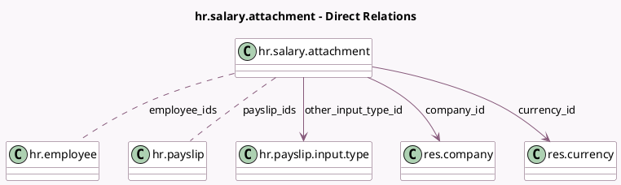

<!-- GENERATED:MODEL -->
---
tags: [odoo, enterprise, generated, model]
---

# hr.salary.attachment

- Module: [[docs/Enterprise Addons/hr_payroll/hr_payroll|hr_payroll]]
- Scope: Enterprise Addons
- Defined in module: yes
- Source files: `models/hr_salary_attachment.py`
- Python classes: `HrSalaryAttachment`
- Description: Salary Adjustment
- Inherits: `mail.thread`

## Field footprint

- Detected fields: 30
- Field types: `Binary` x 1, `Boolean` x 5, `Char` x 6, `Date` x 3, `Integer` x 3, `Many2many` x 2, `Many2one` x 3, `Monetary` x 5, `Selection` x 2
- Relation fields: 5

## Sample fields

- `active_amount`: `Monetary` (comodel `Active Amount`, compute `_compute_active_amount`)
- `attachment`: `Binary` (comodel `Document`)
- `attachment_name`: `Char`
- `company_id`: `Many2one` (comodel `res.company`)
- `currency_id`: `Many2one` (comodel `res.currency`, related `company_id.currency_id`)
- `date_end`: `Date` (comodel `End Date`)
- `date_estimated_end`: `Date` (comodel `Estimated End Date`, compute `_compute_estimated_end`)
- `date_start`: `Date` (comodel `Start Date`)
- `description`: `Char`
- `duration_type`: `Selection` (compute `_compute_duration_type`, store `True`)
- `employee_count`: `Integer` (compute `_compute_employee_count`)
- `employee_ids`: `Many2many` (comodel `hr.employee`)
- `has_done_payslip`: `Boolean` (compute `_compute_has_done_payslip`)
- `has_similar_attachment`: `Boolean` (compute `_compute_has_similar_attachment`)
- `has_similar_attachment_warning`: `Char` (compute `_compute_has_similar_attachment`)
- `has_total_amount`: `Boolean` (comodel `Has Total Amount`, compute `_compute_has_total_amount`)
- `is_quantity`: `Boolean` (related `other_input_type_id.is_quantity`)
- `is_refund`: `Boolean`
- `monthly_amount`: `Monetary` (comodel `Payslip Amount`)
- `monthly_amount_display`: `Char` (comodel `Payslip Amount Display`, compute `_compute_monthly_amount_display`)

## Method hints

- Detected methods: 25
- Action methods: `action_close`, `action_open`, `action_open_employee_salary_attachment`, `action_open_payslips`, `action_split`, `action_unlink`
- Compute methods: `_compute_active_amount`, `_compute_display_name`, `_compute_duration_type`, `_compute_employee_count`, `_compute_estimated_end`, `_compute_has_done_payslip`, `_compute_has_similar_attachment`, `_compute_has_total_amount`, and 7 more
- Onchange methods: none

## Direct relation diagram

## Navigation

- **Parent:** [[docs/Enterprise Addons/hr_payroll/Models]]

<!-- GENERATED:MODEL -->
