<!-- GENERATED:MODEL -->
---
tags: [odoo, enterprise, generated, model]
---

# hr.salary.rule.category

- Module: [[docs/Enterprise Addons/hr_payroll/hr_payroll|hr_payroll]]
- Scope: Enterprise Addons
- Defined in module: yes
- Source files: `models/hr_salary_rule_category.py`
- Python classes: `HrSalaryRuleCategory`
- Description: Salary Rule Category

## Field footprint

- Detected fields: 6
- Field types: `Char` x 2, `Html` x 1, `Many2one` x 2, `One2many` x 1
- Relation fields: 3

## Sample fields

- `children_ids`: `One2many` (comodel `hr.salary.rule.category`)
- `code`: `Char`
- `country_id`: `Many2one` (comodel `res.country`)
- `name`: `Char`
- `note`: `Html`
- `parent_id`: `Many2one` (comodel `hr.salary.rule.category`)

## Method hints

- Detected methods: 4
- Action methods: none
- Compute methods: none
- Onchange methods: none

## Direct relation diagram

```plantuml
@startuml
!define ODOO_COLOR_PRIMARY #714B67
!define ODOO_COLOR_ACCENT #875A7B
!define ODOO_COLOR_BG #FAF7FA

skinparam backgroundColor ODOO_COLOR_BG
skinparam defaultTextAlignment left
skinparam ArrowColor ODOO_COLOR_ACCENT
skinparam ClassBackgroundColor white
skinparam ClassBorderColor ODOO_COLOR_PRIMARY
skinparam ComponentBackgroundColor white
skinparam ComponentBorderColor ODOO_COLOR_PRIMARY
skinparam NoteBackgroundColor #FFF8FF
skinparam NoteBorderColor ODOO_COLOR_ACCENT
skinparam SequenceLifeLineBorderColor ODOO_COLOR_ACCENT
skinparam SequenceLifeLineBackgroundColor #FFFFFF
skinparam SequenceParticipantBorderColor ODOO_COLOR_PRIMARY
skinparam SequenceParticipantBackgroundColor #FFFFFF
skinparam sequence {
  ArrowColor ODOO_COLOR_ACCENT
  ActorBorderColor ODOO_COLOR_PRIMARY
}
title hr.salary.rule.category - Direct Relations
class "hr.salary.rule.category" as hr_salary_rule_category
class "hr.salary.rule.category" as hr_salary_rule_category
class "res.country" as res_country
hr_salary_rule_category --> hr_salary_rule_category : parent_id
hr_salary_rule_category --|> hr_salary_rule_category : children_ids
hr_salary_rule_category --> res_country : country_id
@enduml
```

## Navigation

- **Parent:** [[docs/Enterprise Addons/hr_payroll/Models]]

<!-- GENERATED:MODEL -->
