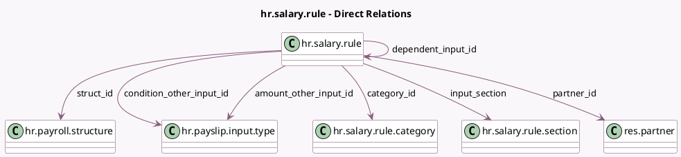

<!-- GENERATED:MODEL -->
---
tags: [odoo, enterprise, generated, model]
---

# hr.salary.rule

- Module: [[docs/Enterprise Addons/hr_payroll/hr_payroll|hr_payroll]]
- Scope: Enterprise Addons
- Defined in module: yes
- Source files: `models/hr_salary_rule.py`
- Python classes: `HrSalaryRule`
- Description: Salary Rule

## Field footprint

- Detected fields: 39
- Field types: `Boolean` x 13, `Char` x 8, `Float` x 3, `Html` x 1, `Integer` x 1, `Many2one` x 8, `Selection` x 3, `Text` x 2
- Relation fields: 8

## Sample fields

- `active`: `Boolean`
- `amount_fix`: `Float`
- `amount_other_input_id`: `Many2one` (comodel `hr.payslip.input.type`)
- `amount_percentage`: `Float`
- `amount_percentage_base`: `Char`
- `amount_python_compute`: `Text`
- `amount_select`: `Selection`
- `appears_on_employee_cost_dashboard`: `Boolean`
- `appears_on_payslip`: `Boolean`
- `bold`: `Boolean`
- `category_id`: `Many2one` (comodel `hr.salary.rule.category`)
- `code`: `Char`
- `color`: `Char` (comodel `Color`)
- `condition_domain`: `Char`
- `condition_other_input_id`: `Many2one` (comodel `hr.payslip.input.type`)
- `condition_python`: `Text`
- `condition_select`: `Selection`
- `country_id`: `Many2one` (related `struct_id.country_id`)
- `dependent_input_id`: `Many2one` (comodel `hr.salary.rule`)
- `indented`: `Boolean`

## Method hints

- Detected methods: 9
- Action methods: none
- Compute methods: `_compute_input_used_in_definition`, `_compute_rule`
- Onchange methods: none

## Direct relation diagram

## Navigation

- **Parent:** [[docs/Enterprise Addons/hr_payroll/Models]]

<!-- GENERATED:MODEL -->
