<!-- GENERATED:MODEL -->
---
tags: [odoo, enterprise, generated, model]
---

# hr.version

- Module: [[docs/Enterprise Addons/hr_payroll/hr_payroll|hr_payroll]]
- Scope: Enterprise Addons
- Defined in module: extension only
- Source files: `models/hr_version.py`
- Python classes: `HrVersion`
- Description: Employee Contract

## Field footprint

- Detected fields: 30
- Field types: `Boolean` x 9, `Date` x 5, `Float` x 3, `Integer` x 1, `Many2one` x 5, `Monetary` x 3, `Properties` x 1, `Selection` x 3
- Relation fields: 5

## Sample fields

- `contract_date_end`: `Date`
- `contract_date_start`: `Date`
- `contract_type_id`: `Many2one`
- `contract_wage`: `Monetary`
- `date_end`: `Date`
- `date_start`: `Date`
- `disabled`: `Boolean`
- `full_time_required_hours`: `Float` (related `resource_calendar_id.full_time_required_hours`)
- `hourly_wage`: `Monetary` (comodel `Hourly Wage`)
- `hours_per_week`: `Float` (related `resource_calendar_id.hours_per_week`)
- `is_current`: `Boolean`
- `is_fulltime`: `Boolean` (related `resource_calendar_id.is_fulltime`)
- `is_future`: `Boolean`
- `is_in_contract`: `Boolean`
- `is_non_resident`: `Boolean`
- `is_past`: `Boolean`
- `payroll_properties`: `Properties` (comodel `Payroll Properties`)
- `payslips_count`: `Integer` (comodel `# Payslips`, compute `_compute_payslips_count`)
- `resource_calendar_id`: `Many2one`
- `schedule_pay`: `Selection` (compute `_compute_schedule_pay`, store `True`)

## Method hints

- Detected methods: 27
- Action methods: `action_configure_template_inputs`, `action_new_salary_attachment`, `action_open_payslips`
- Compute methods: `_compute_payslips_count`, `_compute_schedule_pay`, `_compute_show_schedule_pay`, `_compute_wage_type`, `_compute_work_time_rate`
- Onchange methods: none

## Direct relation diagram

```plantuml
@startuml
!define ODOO_COLOR_PRIMARY #714B67
!define ODOO_COLOR_ACCENT #875A7B
!define ODOO_COLOR_BG #FAF7FA

skinparam backgroundColor ODOO_COLOR_BG
skinparam defaultTextAlignment left
skinparam ArrowColor ODOO_COLOR_ACCENT
skinparam ClassBackgroundColor white
skinparam ClassBorderColor ODOO_COLOR_PRIMARY
skinparam ComponentBackgroundColor white
skinparam ComponentBorderColor ODOO_COLOR_PRIMARY
skinparam NoteBackgroundColor #FFF8FF
skinparam NoteBorderColor ODOO_COLOR_ACCENT
skinparam SequenceLifeLineBorderColor ODOO_COLOR_ACCENT
skinparam SequenceLifeLineBackgroundColor #FFFFFF
skinparam SequenceParticipantBorderColor ODOO_COLOR_PRIMARY
skinparam SequenceParticipantBackgroundColor #FFFFFF
skinparam sequence {
  ArrowColor ODOO_COLOR_ACCENT
  ActorBorderColor ODOO_COLOR_PRIMARY
}
title hr.version - Direct Relations
class "hr.version" as hr_version
class "resource.calendar" as resource_calendar
hr_version --> resource_calendar : standard_calendar_id
@enduml
```

## Navigation

- **Parent:** [[docs/Enterprise Addons/hr_payroll/Models]]

<!-- GENERATED:MODEL -->
