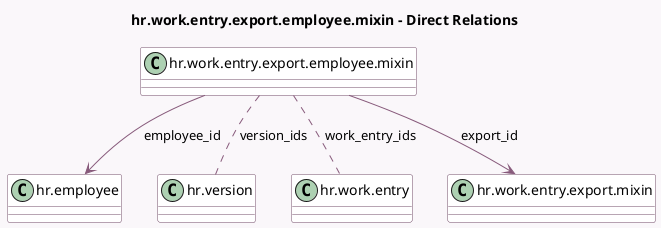

<!-- GENERATED:MODEL -->
---
tags: [odoo, enterprise, generated, model]
---

# hr.work.entry.export.employee.mixin

- Module: [[docs/Enterprise Addons/hr_payroll/hr_payroll|hr_payroll]]
- Scope: Enterprise Addons
- Defined in module: yes
- Source files: `models/hr_work_entry_export_mixin.py`
- Python classes: `HrWorkEntryExportEmployeeMixin`
- Description: Work Entry Export Employee

## Field footprint

- Detected fields: 5
- Field types: `Many2many` x 2, `Many2one` x 3
- Relation fields: 5

## Sample fields

- `company_id`: `Many2one` (related `export_id.company_id`, store `True`)
- `employee_id`: `Many2one` (comodel `hr.employee`)
- `export_id`: `Many2one` (comodel `hr.work.entry.export.mixin`)
- `version_ids`: `Many2many` (comodel `hr.version`, compute `_compute_contract_ids`, store `True`)
- `work_entry_ids`: `Many2many` (comodel `hr.work.entry`, compute `_compute_work_entry_ids`)

## Method hints

- Detected methods: 7
- Action methods: `action_open_work_entries`
- Compute methods: `_compute_contract_ids`, `_compute_work_entry_ids`
- Onchange methods: none

## Direct relation diagram

## Navigation

- **Parent:** [[docs/Enterprise Addons/hr_payroll/Models]]

<!-- GENERATED:MODEL -->
