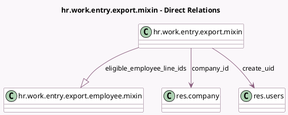

<!-- GENERATED:MODEL -->
---
tags: [odoo, enterprise, generated, model]
---

# hr.work.entry.export.mixin

- Module: [[docs/Enterprise Addons/hr_payroll/hr_payroll|hr_payroll]]
- Scope: Enterprise Addons
- Defined in module: yes
- Source files: `models/hr_work_entry_export_mixin.py`
- Python classes: `HrWorkEntryExportMixin`
- Description: Work Entry Export Mixin

## Field footprint

- Detected fields: 10
- Field types: `Binary` x 1, `Char` x 1, `Date` x 2, `Integer` x 2, `Many2one` x 2, `One2many` x 1, `Selection` x 1
- Relation fields: 3

## Sample fields

- `company_id`: `Many2one` (comodel `res.company`)
- `create_uid`: `Many2one` (comodel `res.users`)
- `eligible_employee_count`: `Integer` (comodel `Eligible Employees Count`, compute `_compute_eligible_employee_count`)
- `eligible_employee_line_ids`: `One2many` (comodel `hr.work.entry.export.employee.mixin`)
- `export_file`: `Binary` (comodel `Export File`)
- `export_filename`: `Char` (comodel `Export Filename`)
- `period_start`: `Date` (comodel `Period Start`, compute `_compute_period_dates`, store `True`)
- `period_stop`: `Date` (comodel `Period Stop`, compute `_compute_period_dates`, store `True`)
- `reference_month`: `Selection`
- `reference_year`: `Integer` (comodel `Reference Year`)

## Method hints

- Detected methods: 17
- Action methods: `action_export_file`, `action_open_employees`, `action_populate`
- Compute methods: `_compute_display_name`, `_compute_eligible_employee_count`, `_compute_period_dates`
- Onchange methods: none

## Direct relation diagram

## Navigation

- **Parent:** [[docs/Enterprise Addons/hr_payroll/Models]]

<!-- GENERATED:MODEL -->
