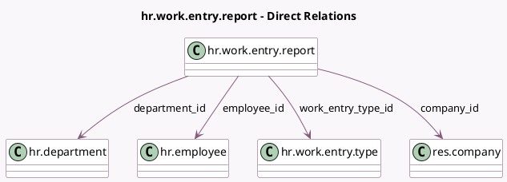

<!-- GENERATED:MODEL -->
---
tags: [odoo, enterprise, generated, model]
---

# hr.work.entry.report

- Module: [[docs/Enterprise Addons/hr_payroll/hr_payroll|hr_payroll]]
- Scope: Enterprise Addons
- Defined in module: yes
- Source files: `report/hr_work_entry_report.py`
- Python classes: `HrWorkEntryReport`
- Description: Work Entries Analysis Report

## Field footprint

- Detected fields: 8
- Field types: `Date` x 1, `Float` x 1, `Many2one` x 4, `Selection` x 2
- Relation fields: 4

## Sample fields

- `company_id`: `Many2one` (comodel `res.company`)
- `date`: `Date` (comodel `Date`)
- `department_id`: `Many2one` (comodel `hr.department`)
- `employee_id`: `Many2one` (comodel `hr.employee`)
- `number_of_days`: `Float` (comodel `Days`)
- `state`: `Selection`
- `work_entry_source`: `Selection`
- `work_entry_type_id`: `Many2one` (comodel `hr.work.entry.type`)

## Method hints

- Detected methods: 1
- Action methods: none
- Compute methods: none
- Onchange methods: none

## Direct relation diagram

## Navigation

- **Parent:** [[docs/Enterprise Addons/hr_payroll/Models]]

<!-- GENERATED:MODEL -->
