<!-- GENERATED:MODEL -->
---
tags: [odoo, enterprise, generated, model]
---

# hr.work.entry.type

- Module: [[docs/Enterprise Addons/hr_payroll/hr_payroll|hr_payroll]]
- Scope: Enterprise Addons
- Defined in module: extension only
- Source files: `models/hr_work_entry_type.py`
- Python classes: `HrWorkEntryType`
- Description: HR Work Entry Type

## Field footprint

- Detected fields: 5
- Field types: `Boolean` x 1, `Char` x 1, `Many2many` x 1, `Selection` x 2
- Relation fields: 1

## Sample fields

- `current_companies_country_codes`: `Char` (compute `_compute_current_companies_country_codes`)
- `is_unforeseen`: `Boolean`
- `round_days`: `Selection`
- `round_days_type`: `Selection`
- `unpaid_structure_ids`: `Many2many` (comodel `hr.payroll.structure`)

## Method hints

- Detected methods: 2
- Action methods: none
- Compute methods: `_compute_current_companies_country_codes`
- Onchange methods: none

## Direct relation diagram

```plantuml
@startuml
!define ODOO_COLOR_PRIMARY #714B67
!define ODOO_COLOR_ACCENT #875A7B
!define ODOO_COLOR_BG #FAF7FA

skinparam backgroundColor ODOO_COLOR_BG
skinparam defaultTextAlignment left
skinparam ArrowColor ODOO_COLOR_ACCENT
skinparam ClassBackgroundColor white
skinparam ClassBorderColor ODOO_COLOR_PRIMARY
skinparam ComponentBackgroundColor white
skinparam ComponentBorderColor ODOO_COLOR_PRIMARY
skinparam NoteBackgroundColor #FFF8FF
skinparam NoteBorderColor ODOO_COLOR_ACCENT
skinparam SequenceLifeLineBorderColor ODOO_COLOR_ACCENT
skinparam SequenceLifeLineBackgroundColor #FFFFFF
skinparam SequenceParticipantBorderColor ODOO_COLOR_PRIMARY
skinparam SequenceParticipantBackgroundColor #FFFFFF
skinparam sequence {
  ArrowColor ODOO_COLOR_ACCENT
  ActorBorderColor ODOO_COLOR_PRIMARY
}
title hr.work.entry.type - Direct Relations
class "hr.work.entry.type" as hr_work_entry_type
class "hr.payroll.structure" as hr_payroll_structure
hr_work_entry_type .. hr_payroll_structure : unpaid_structure_ids
@enduml
```

## Navigation

- **Parent:** [[docs/Enterprise Addons/hr_payroll/Models]]

<!-- GENERATED:MODEL -->
