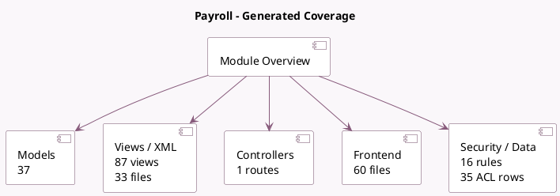

<!-- GENERATED:MODULE -->
---
tags: [odoo, enterprise, module]
---

# Payroll

- Scope: Enterprise Addons
- Source: enterprise/hr_payroll
- Dependencies: [[docs/Enterprise Addons/hr_work_entry_enterprise/hr_work_entry_enterprise|hr_work_entry_enterprise]], [[docs/Community Addons/mail/mail|mail]], [[docs/Community Addons/html_editor/html_editor|html_editor]]

## Summary

Manage your employee payroll

## Generated coverage

- Models: 37
- XML files with UI/data artifacts: 33
- Views: 87
- Actions: 52
- Menus: 28
- Rules (ir.rule): 16
- Access CSV entries: 35
- Controller units: 1
- Frontend asset files: 60

## Module map

## Detail notes

- Models: [[docs/Enterprise Addons/hr_payroll/Models|Models]] (37)
- Views and XML: [[docs/Enterprise Addons/hr_payroll/Views|Views]] (33 files)
- Controllers: [[docs/Enterprise Addons/hr_payroll/Controllers|Controllers]] (1)
- Frontend: [[docs/Enterprise Addons/hr_payroll/Frontend|Frontend]] (60 files)

## Key models

- `hr.employee`
- `hr.payroll.dashboard.warning`
- `hr.payroll.declaration.mixin`
- `hr.payroll.edit.payslip.line`
- `hr.payroll.edit.payslip.lines.wizard`
- `hr.payroll.edit.payslip.worked.days.line`
- `hr.payroll.employee.declaration`
- `hr.payroll.headcount`
- `hr.payroll.headcount.line`
- `hr.payroll.headcount.working.rate`
- `hr.payroll.index`
- `hr.payroll.note`

## Navigation

- [[../Enterprise Addons/Enterprise Addons|Back to scope]]
- [[../../docs/docs|Back to docs]]

<!-- GENERATED:MODULE -->

