<!-- GENERATED:MODEL -->
---
tags: [odoo, enterprise, generated, model]
---

# hr.payslip.line

- Module: [[docs/Enterprise Addons/hr_payroll_account/hr_payroll_account|hr_payroll_account]]
- Scope: Enterprise Addons
- Defined in module: extension only
- Source files: `models/hr_payslip_line.py`
- Python classes: `HrPayslipLine`

## Field footprint

- Detected fields: 2
- Field types: `Many2many` x 2
- Relation fields: 2

## Sample fields

- `credit_tag_ids`: `Many2many` (comodel `account.account.tag`, compute `_compute_credit_tags`)
- `debit_tag_ids`: `Many2many` (comodel `account.account.tag`, compute `_compute_debit_tags`)

## Method hints

- Detected methods: 2
- Action methods: none
- Compute methods: `_compute_credit_tags`, `_compute_debit_tags`
- Onchange methods: none

## Direct relation diagram

```plantuml
@startuml
!define ODOO_COLOR_PRIMARY #714B67
!define ODOO_COLOR_ACCENT #875A7B
!define ODOO_COLOR_BG #FAF7FA

skinparam backgroundColor ODOO_COLOR_BG
skinparam defaultTextAlignment left
skinparam ArrowColor ODOO_COLOR_ACCENT
skinparam ClassBackgroundColor white
skinparam ClassBorderColor ODOO_COLOR_PRIMARY
skinparam ComponentBackgroundColor white
skinparam ComponentBorderColor ODOO_COLOR_PRIMARY
skinparam NoteBackgroundColor #FFF8FF
skinparam NoteBorderColor ODOO_COLOR_ACCENT
skinparam SequenceLifeLineBorderColor ODOO_COLOR_ACCENT
skinparam SequenceLifeLineBackgroundColor #FFFFFF
skinparam SequenceParticipantBorderColor ODOO_COLOR_PRIMARY
skinparam SequenceParticipantBackgroundColor #FFFFFF
skinparam sequence {
  ArrowColor ODOO_COLOR_ACCENT
  ActorBorderColor ODOO_COLOR_PRIMARY
}
title hr.payslip.line - Direct Relations
class "hr.payslip.line" as hr_payslip_line
class "account.account.tag" as account_account_tag
hr_payslip_line .. account_account_tag : debit_tag_ids
hr_payslip_line .. account_account_tag : credit_tag_ids
@enduml
```

## Navigation

- **Parent:** [[docs/Enterprise Addons/hr_payroll_account/Models]]

<!-- GENERATED:MODEL -->
