<!-- GENERATED:MODEL -->
---
tags: [odoo, enterprise, generated, model]
---

# hr.payslip

- Module: [[docs/Enterprise Addons/hr_payroll_account/hr_payroll_account|hr_payroll_account]]
- Scope: Enterprise Addons
- Defined in module: extension only
- Source files: `models/hr_payslip.py`
- Python classes: `HrPayslip`

## Field footprint

- Detected fields: 5
- Field types: `Boolean` x 1, `Date` x 1, `Many2one` x 2, `Selection` x 1
- Relation fields: 2

## Sample fields

- `batch_payroll_move_lines`: `Boolean` (related `company_id.batch_payroll_move_lines`)
- `date`: `Date` (comodel `Date Account`)
- `journal_id`: `Many2one` (comodel `account.journal`, related `struct_id.journal_id`)
- `move_id`: `Many2one` (comodel `account.move`)
- `move_state`: `Selection` (related `move_id.state`)

## Method hints

- Detected methods: 13
- Action methods: `action_open_move`, `action_payslip_cancel`, `action_payslip_done`, `action_register_payment`
- Compute methods: none
- Onchange methods: none

## Direct relation diagram

```plantuml
@startuml
!define ODOO_COLOR_PRIMARY #714B67
!define ODOO_COLOR_ACCENT #875A7B
!define ODOO_COLOR_BG #FAF7FA

skinparam backgroundColor ODOO_COLOR_BG
skinparam defaultTextAlignment left
skinparam ArrowColor ODOO_COLOR_ACCENT
skinparam ClassBackgroundColor white
skinparam ClassBorderColor ODOO_COLOR_PRIMARY
skinparam ComponentBackgroundColor white
skinparam ComponentBorderColor ODOO_COLOR_PRIMARY
skinparam NoteBackgroundColor #FFF8FF
skinparam NoteBorderColor ODOO_COLOR_ACCENT
skinparam SequenceLifeLineBorderColor ODOO_COLOR_ACCENT
skinparam SequenceLifeLineBackgroundColor #FFFFFF
skinparam SequenceParticipantBorderColor ODOO_COLOR_PRIMARY
skinparam SequenceParticipantBackgroundColor #FFFFFF
skinparam sequence {
  ArrowColor ODOO_COLOR_ACCENT
  ActorBorderColor ODOO_COLOR_PRIMARY
}
title hr.payslip - Direct Relations
class "hr.payslip" as hr_payslip
class "account.journal" as account_journal
class "account.move" as account_move
hr_payslip --> account_journal : journal_id
hr_payslip --> account_move : move_id
@enduml
```

## Navigation

- **Parent:** [[docs/Enterprise Addons/hr_payroll_account/Models]]

<!-- GENERATED:MODEL -->
