<!-- GENERATED:MODEL -->
---
tags: [odoo, enterprise, generated, model]
---

# hr.salary.rule

- Module: [[docs/Enterprise Addons/hr_payroll_account/hr_payroll_account|hr_payroll_account]]
- Scope: Enterprise Addons
- Defined in module: yes
- Source files: `models/hr_salary_rule.py`
- Python classes: `HrSalaryRule`
- Inherits: `analytic.mixin`

## Field footprint

- Detected fields: 9
- Field types: `Boolean` x 4, `Json` x 1, `Many2many` x 2, `Many2one` x 2
- Relation fields: 4

## Sample fields

- `account_credit`: `Many2one` (comodel `account.account`)
- `account_debit`: `Many2one` (comodel `account.account`)
- `analytic_distribution`: `Json`
- `batch_payroll_move_lines`: `Boolean` (compute `_compute_batch_payroll_move_lines`)
- `credit_tag_ids`: `Many2many` (comodel `account.account.tag`)
- `debit_tag_ids`: `Many2many` (comodel `account.account.tag`)
- `employee_move_line`: `Boolean`
- `not_computed_in_net`: `Boolean`
- `split_move_lines`: `Boolean`

## Method hints

- Detected methods: 1
- Action methods: none
- Compute methods: `_compute_batch_payroll_move_lines`
- Onchange methods: none

## Direct relation diagram

```plantuml
@startuml
!define ODOO_COLOR_PRIMARY #714B67
!define ODOO_COLOR_ACCENT #875A7B
!define ODOO_COLOR_BG #FAF7FA

skinparam backgroundColor ODOO_COLOR_BG
skinparam defaultTextAlignment left
skinparam ArrowColor ODOO_COLOR_ACCENT
skinparam ClassBackgroundColor white
skinparam ClassBorderColor ODOO_COLOR_PRIMARY
skinparam ComponentBackgroundColor white
skinparam ComponentBorderColor ODOO_COLOR_PRIMARY
skinparam NoteBackgroundColor #FFF8FF
skinparam NoteBorderColor ODOO_COLOR_ACCENT
skinparam SequenceLifeLineBorderColor ODOO_COLOR_ACCENT
skinparam SequenceLifeLineBackgroundColor #FFFFFF
skinparam SequenceParticipantBorderColor ODOO_COLOR_PRIMARY
skinparam SequenceParticipantBackgroundColor #FFFFFF
skinparam sequence {
  ArrowColor ODOO_COLOR_ACCENT
  ActorBorderColor ODOO_COLOR_PRIMARY
}
title hr.salary.rule - Direct Relations
class "hr.salary.rule" as hr_salary_rule
class "account.account" as account_account
class "account.account.tag" as account_account_tag
hr_salary_rule --> account_account : account_debit
hr_salary_rule --> account_account : account_credit
hr_salary_rule .. account_account_tag : debit_tag_ids
hr_salary_rule .. account_account_tag : credit_tag_ids
@enduml
```

## Navigation

- **Parent:** [[docs/Enterprise Addons/hr_payroll_account/Models]]

<!-- GENERATED:MODEL -->
