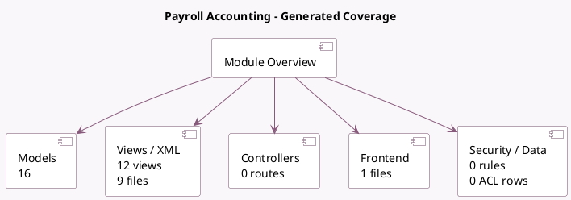

<!-- GENERATED:MODULE -->
---
tags: [odoo, enterprise, module]
---

# Payroll Accounting

- Scope: Enterprise Addons
- Source: enterprise/hr_payroll_account
- Dependencies: [[docs/Enterprise Addons/hr_payroll/hr_payroll|hr_payroll]], [[docs/Enterprise Addons/accountant/accountant|accountant]], [[docs/Community Addons/base_iban/base_iban|base_iban]]

## Generated coverage

- Models: 16
- XML files with UI/data artifacts: 9
- Views: 12
- Actions: 1
- Menus: 0
- Rules (ir.rule): 0
- Access CSV entries: 0
- Controller units: 0
- Frontend asset files: 1

## Module map

## Detail notes

- Models: [[docs/Enterprise Addons/hr_payroll_account/Models|Models]] (16)
- Views and XML: [[docs/Enterprise Addons/hr_payroll_account/Views|Views]] (9 files)
- Frontend: [[docs/Enterprise Addons/hr_payroll_account/Frontend|Frontend]] (1 files)

## Key models

- `account.chart.template`
- `account.journal`
- `account.move`
- `account.move.line`
- `account.payment`
- `account.payment.register`
- `hr.payroll.payment.report.wizard`
- `hr.payroll.structure`
- `hr.payslip`
- `hr.payslip.line`
- `hr.payslip.run`
- `hr.salary.rule`

## Navigation

- [[../Enterprise Addons/Enterprise Addons|Back to scope]]
- [[../../docs/docs|Back to docs]]

<!-- GENERATED:MODULE -->

