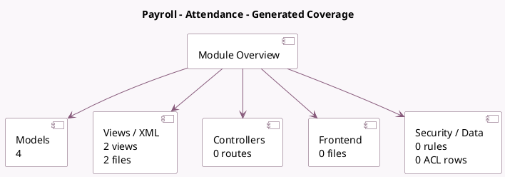

<!-- GENERATED:MODULE -->
---
tags: [odoo, enterprise, module]
---

# Payroll - Attendance

- Scope: Enterprise Addons
- Source: enterprise/hr_payroll_attendance
- Dependencies: [[docs/Enterprise Addons/hr_work_entry_attendance/hr_work_entry_attendance|hr_work_entry_attendance]], [[docs/Enterprise Addons/hr_payroll/hr_payroll|hr_payroll]]

## Summary

Manage extra hours for your hourly paid employees using attendance

## Generated coverage

- Models: 4
- XML files with UI/data artifacts: 2
- Views: 2
- Actions: 0
- Menus: 0
- Rules (ir.rule): 0
- Access CSV entries: 0
- Controller units: 0
- Frontend asset files: 0

## Module map

## Detail notes

- Models: [[docs/Enterprise Addons/hr_payroll_attendance/Models|Models]] (4)
- Views and XML: [[docs/Enterprise Addons/hr_payroll_attendance/Views|Views]] (2 files)

## Key models

- `hr.employee`
- `hr.payslip`
- `hr.payslip.worked_days`
- `hr.version`

## Navigation

- [[../Enterprise Addons/Enterprise Addons|Back to scope]]
- [[../../docs/docs|Back to docs]]

<!-- GENERATED:MODULE -->

