<!-- GENERATED:MODEL -->
---
tags: [odoo, enterprise, generated, model]
---

# hr.expense

- Module: [[docs/Enterprise Addons/hr_payroll_expense/hr_payroll_expense|hr_payroll_expense]]
- Scope: Enterprise Addons
- Defined in module: extension only
- Source files: `models/hr_expense.py`
- Python classes: `HrExpense`

## Field footprint

- Detected fields: 2
- Field types: `Boolean` x 1, `Many2one` x 1
- Relation fields: 1

## Sample fields

- `payslip_id`: `Many2one` (comodel `hr.payslip`)
- `refund_in_payslip`: `Boolean`

## Method hints

- Detected methods: 8
- Action methods: `action_open_payslip`, `action_refuse`, `action_remove_from_payslip`, `action_report_in_next_payslip`, `action_reset`
- Compute methods: `_compute_is_editable`
- Onchange methods: none

## Direct relation diagram

```plantuml
@startuml
!define ODOO_COLOR_PRIMARY #714B67
!define ODOO_COLOR_ACCENT #875A7B
!define ODOO_COLOR_BG #FAF7FA

skinparam backgroundColor ODOO_COLOR_BG
skinparam defaultTextAlignment left
skinparam ArrowColor ODOO_COLOR_ACCENT
skinparam ClassBackgroundColor white
skinparam ClassBorderColor ODOO_COLOR_PRIMARY
skinparam ComponentBackgroundColor white
skinparam ComponentBorderColor ODOO_COLOR_PRIMARY
skinparam NoteBackgroundColor #FFF8FF
skinparam NoteBorderColor ODOO_COLOR_ACCENT
skinparam SequenceLifeLineBorderColor ODOO_COLOR_ACCENT
skinparam SequenceLifeLineBackgroundColor #FFFFFF
skinparam SequenceParticipantBorderColor ODOO_COLOR_PRIMARY
skinparam SequenceParticipantBackgroundColor #FFFFFF
skinparam sequence {
  ArrowColor ODOO_COLOR_ACCENT
  ActorBorderColor ODOO_COLOR_PRIMARY
}
title hr.expense - Direct Relations
class "hr.expense" as hr_expense
class "hr.payslip" as hr_payslip
hr_expense --> hr_payslip : payslip_id
@enduml
```

## Navigation

- **Parent:** [[docs/Enterprise Addons/hr_payroll_expense/Models]]

<!-- GENERATED:MODEL -->
