<!-- GENERATED:MODEL -->
---
tags: [odoo, enterprise, generated, model]
---

# hr.payslip

- Module: [[docs/Enterprise Addons/hr_payroll_expense/hr_payroll_expense|hr_payroll_expense]]
- Scope: Enterprise Addons
- Defined in module: extension only
- Source files: `models/hr_payslip.py`
- Python classes: `HrPayslip`

## Field footprint

- Detected fields: 2
- Field types: `Integer` x 1, `One2many` x 1
- Relation fields: 1

## Sample fields

- `expense_ids`: `One2many` (comodel `hr.expense`)
- `expenses_count`: `Integer` (compute `_compute_expenses_count`)

## Method hints

- Detected methods: 13
- Action methods: `action_open_expenses`, `action_payslip_cancel`, `action_payslip_draft`
- Compute methods: `_compute_expenses_count`, `_compute_input_line_ids`
- Onchange methods: none

## Direct relation diagram

```plantuml
@startuml
!define ODOO_COLOR_PRIMARY #714B67
!define ODOO_COLOR_ACCENT #875A7B
!define ODOO_COLOR_BG #FAF7FA

skinparam backgroundColor ODOO_COLOR_BG
skinparam defaultTextAlignment left
skinparam ArrowColor ODOO_COLOR_ACCENT
skinparam ClassBackgroundColor white
skinparam ClassBorderColor ODOO_COLOR_PRIMARY
skinparam ComponentBackgroundColor white
skinparam ComponentBorderColor ODOO_COLOR_PRIMARY
skinparam NoteBackgroundColor #FFF8FF
skinparam NoteBorderColor ODOO_COLOR_ACCENT
skinparam SequenceLifeLineBorderColor ODOO_COLOR_ACCENT
skinparam SequenceLifeLineBackgroundColor #FFFFFF
skinparam SequenceParticipantBorderColor ODOO_COLOR_PRIMARY
skinparam SequenceParticipantBackgroundColor #FFFFFF
skinparam sequence {
  ArrowColor ODOO_COLOR_ACCENT
  ActorBorderColor ODOO_COLOR_PRIMARY
}
title hr.payslip - Direct Relations
class "hr.payslip" as hr_payslip
class "hr.expense" as hr_expense
hr_payslip --|> hr_expense : expense_ids
@enduml
```

## Navigation

- **Parent:** [[docs/Enterprise Addons/hr_payroll_expense/Models]]

<!-- GENERATED:MODEL -->
