<!-- GENERATED:MODEL -->
---
tags: [odoo, enterprise, generated, model]
---

# hr.job

- Module: [[docs/Enterprise Addons/hr_recruitment_integration_base/hr_recruitment_integration_base|hr_recruitment_integration_base]]
- Scope: Enterprise Addons
- Defined in module: extension only
- Source files: `models/hr_job.py`
- Python classes: `HrJob`

## Field footprint

- Detected fields: 9
- Field types: `Date` x 2, `Integer` x 1, `Many2one` x 2, `Monetary` x 2, `One2many` x 1, `Selection` x 1
- Relation fields: 3

## Sample fields

- `currency_id`: `Many2one` (comodel `res.currency`, related `company_id.currency_id`)
- `date_from`: `Date`
- `date_to`: `Date`
- `job_post_count`: `Integer` (compute `_compute_job_post_count`)
- `job_post_ids`: `One2many` (comodel `hr.job.post`)
- `payment_interval`: `Selection`
- `salary_max`: `Monetary` (comodel `Maximum Salary`)
- `salary_min`: `Monetary` (comodel `Minimum Salary`)
- `schedule_id`: `Many2one` (comodel `resource.calendar`)

## Method hints

- Detected methods: 5
- Action methods: `action_open_hr_job_post`, `action_post_job`
- Compute methods: `_compute_job_post_count`
- Onchange methods: `_onchange_salary`

## Direct relation diagram

```plantuml
@startuml
!define ODOO_COLOR_PRIMARY #714B67
!define ODOO_COLOR_ACCENT #875A7B
!define ODOO_COLOR_BG #FAF7FA

skinparam backgroundColor ODOO_COLOR_BG
skinparam defaultTextAlignment left
skinparam ArrowColor ODOO_COLOR_ACCENT
skinparam ClassBackgroundColor white
skinparam ClassBorderColor ODOO_COLOR_PRIMARY
skinparam ComponentBackgroundColor white
skinparam ComponentBorderColor ODOO_COLOR_PRIMARY
skinparam NoteBackgroundColor #FFF8FF
skinparam NoteBorderColor ODOO_COLOR_ACCENT
skinparam SequenceLifeLineBorderColor ODOO_COLOR_ACCENT
skinparam SequenceLifeLineBackgroundColor #FFFFFF
skinparam SequenceParticipantBorderColor ODOO_COLOR_PRIMARY
skinparam SequenceParticipantBackgroundColor #FFFFFF
skinparam sequence {
  ArrowColor ODOO_COLOR_ACCENT
  ActorBorderColor ODOO_COLOR_PRIMARY
}
title hr.job - Direct Relations
class "hr.job" as hr_job
class "hr.job.post" as hr_job_post
class "res.currency" as res_currency
class "resource.calendar" as resource_calendar
hr_job --|> hr_job_post : job_post_ids
hr_job --> res_currency : currency_id
hr_job --> resource_calendar : schedule_id
@enduml
```

## Navigation

- **Parent:** [[docs/Enterprise Addons/hr_recruitment_integration_base/Models]]

<!-- GENERATED:MODEL -->
