<!-- GENERATED:MODEL -->
---
tags: [odoo, enterprise, generated, model]
---

# hr.job.post

- Module: [[docs/Enterprise Addons/hr_recruitment_integration_base/hr_recruitment_integration_base|hr_recruitment_integration_base]]
- Scope: Enterprise Addons
- Defined in module: yes
- Source files: `models/hr_job_post.py`
- Python classes: `HrJobPost`
- Description: Job Post
- Inherits: `mail.activity.mixin`, `mail.thread`

## Field footprint

- Detected fields: 13
- Field types: `Binary` x 1, `Char` x 1, `Date` x 2, `Html` x 1, `Json` x 1, `Many2one` x 4, `Selection` x 2, `Text` x 1
- Relation fields: 4

## Sample fields

- `api_data`: `Json`
- `apply_method`: `Selection`
- `apply_vector`: `Char` (compute `_compute_apply_vector`, store `True`)
- `campaign_end_date`: `Date`
- `campaign_start_date`: `Date`
- `company_id`: `Many2one` (related `job_id.company_id`)
- `job_id`: `Many2one` (comodel `hr.job`)
- `platform_icon`: `Binary` (related `platform_id.avatar_128`)
- `platform_id`: `Many2one` (comodel `hr.recruitment.platform`)
- `post_html`: `Html`
- `recruiter_id`: `Many2one` (comodel `res.users`, related `job_id.user_id`)
- `status`: `Selection`
- `status_message`: `Text`

## Method hints

- Detected methods: 14
- Action methods: `action_post_job`, `action_post_now`, `action_stop_campaign`, `action_update_job_post`, `action_update_job_post_check`
- Compute methods: `_compute_apply_vector`, `_compute_display_name`
- Onchange methods: none

## Direct relation diagram

```plantuml
@startuml
!define ODOO_COLOR_PRIMARY #714B67
!define ODOO_COLOR_ACCENT #875A7B
!define ODOO_COLOR_BG #FAF7FA

skinparam backgroundColor ODOO_COLOR_BG
skinparam defaultTextAlignment left
skinparam ArrowColor ODOO_COLOR_ACCENT
skinparam ClassBackgroundColor white
skinparam ClassBorderColor ODOO_COLOR_PRIMARY
skinparam ComponentBackgroundColor white
skinparam ComponentBorderColor ODOO_COLOR_PRIMARY
skinparam NoteBackgroundColor #FFF8FF
skinparam NoteBorderColor ODOO_COLOR_ACCENT
skinparam SequenceLifeLineBorderColor ODOO_COLOR_ACCENT
skinparam SequenceLifeLineBackgroundColor #FFFFFF
skinparam SequenceParticipantBorderColor ODOO_COLOR_PRIMARY
skinparam SequenceParticipantBackgroundColor #FFFFFF
skinparam sequence {
  ArrowColor ODOO_COLOR_ACCENT
  ActorBorderColor ODOO_COLOR_PRIMARY
}
title hr.job.post - Direct Relations
class "hr.job.post" as hr_job_post
class "hr.job" as hr_job
class "hr.recruitment.platform" as hr_recruitment_platform
class "res.users" as res_users
hr_job_post --> hr_job : job_id
hr_job_post --> res_users : recruiter_id
hr_job_post --> hr_recruitment_platform : platform_id
@enduml
```

## Navigation

- **Parent:** [[docs/Enterprise Addons/hr_recruitment_integration_base/Models]]

<!-- GENERATED:MODEL -->
