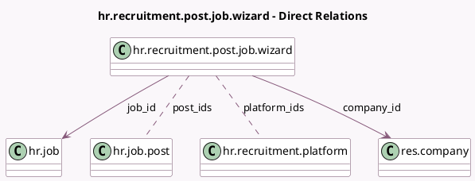

<!-- GENERATED:MODEL -->
---
tags: [odoo, enterprise, generated, model]
---

# hr.recruitment.post.job.wizard

- Module: [[docs/Enterprise Addons/hr_recruitment_integration_base/hr_recruitment_integration_base|hr_recruitment_integration_base]]
- Scope: Enterprise Addons
- Defined in module: yes
- Source files: `wizard/hr_recruitment_post.py`
- Python classes: `HrRecruitmentPostJobWizard`
- Description: Post Job

## Field footprint

- Detected fields: 13
- Field types: `Char` x 1, `Date` x 4, `Html` x 1, `Json` x 1, `Many2many` x 2, `Many2one` x 3, `Selection` x 1
- Relation fields: 5

## Sample fields

- `api_data`: `Json`
- `apply_method`: `Selection`
- `campaign_end_date`: `Date`
- `campaign_start_date`: `Date`
- `company_id`: `Many2one` (comodel `res.company`)
- `date_from`: `Date` (related `job_id.date_from`)
- `date_to`: `Date` (related `job_id.date_to`)
- `industry_id`: `Many2one` (related `job_id.industry_id`)
- `job_apply_mail`: `Char` (compute `_compute_job_apply_mail`, store `True`)
- `job_id`: `Many2one` (comodel `hr.job`)
- `platform_ids`: `Many2many` (comodel `hr.recruitment.platform`)
- `post_html`: `Html` (compute `_compute_post_html`, store `True`)
- `post_ids`: `Many2many` (comodel `hr.job.post`)

## Method hints

- Detected methods: 8
- Action methods: `action_post_job`
- Compute methods: `_compute_job_apply_mail`, `_compute_post_html`
- Onchange methods: none

## Direct relation diagram

## Navigation

- **Parent:** [[docs/Enterprise Addons/hr_recruitment_integration_base/Models]]

<!-- GENERATED:MODEL -->
