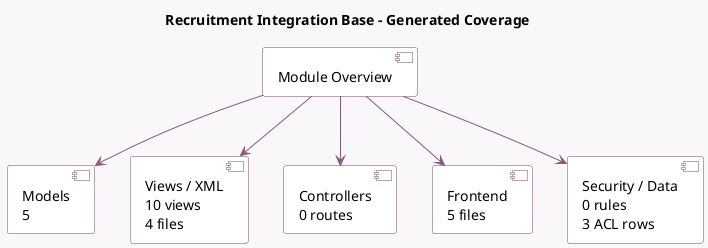

<!-- GENERATED:MODULE -->
---
tags: [odoo, enterprise, module]
---

# Recruitment Integration Base

- Scope: Enterprise Addons
- Source: enterprise/hr_recruitment_integration_base
- Dependencies: [[docs/Community Addons/hr_recruitment/hr_recruitment|hr_recruitment]]

## Generated coverage

- Models: 5
- XML files with UI/data artifacts: 4
- Views: 10
- Actions: 3
- Menus: 1
- Rules (ir.rule): 0
- Access CSV entries: 3
- Controller units: 0
- Frontend asset files: 5

## Module map

## Detail notes

- Models: [[docs/Enterprise Addons/hr_recruitment_integration_base/Models|Models]] (5)
- Views and XML: [[docs/Enterprise Addons/hr_recruitment_integration_base/Views|Views]] (4 files)
- Frontend: [[docs/Enterprise Addons/hr_recruitment_integration_base/Frontend|Frontend]] (5 files)

## Key models

- `hr.applicant`
- `hr.job`
- `hr.job.post`
- `hr.recruitment.platform`
- `hr.recruitment.post.job.wizard`

## Navigation

- [[../Enterprise Addons/Enterprise Addons|Back to scope]]
- [[../../docs/docs|Back to docs]]

<!-- GENERATED:MODULE -->

