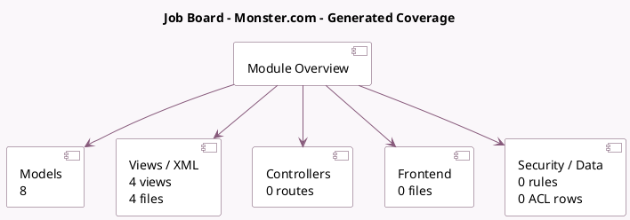

<!-- GENERATED:MODULE -->
---
tags: [odoo, enterprise, module]
---

# Job Board - Monster.com

- Scope: Enterprise Addons
- Source: enterprise/hr_recruitment_integration_monster
- Dependencies: [[docs/Enterprise Addons/hr_recruitment_integration_base/hr_recruitment_integration_base|hr_recruitment_integration_base]], [[docs/Enterprise Addons/hr_recruitment_extract/hr_recruitment_extract|hr_recruitment_extract]]

## Summary

Allow user to share job positions on Monster Job board

## Generated coverage

- Models: 8
- XML files with UI/data artifacts: 4
- Views: 4
- Actions: 0
- Menus: 0
- Rules (ir.rule): 0
- Access CSV entries: 0
- Controller units: 0
- Frontend asset files: 0

## Module map

## Detail notes

- Models: [[docs/Enterprise Addons/hr_recruitment_integration_monster/Models|Models]] (8)
- Views and XML: [[docs/Enterprise Addons/hr_recruitment_integration_monster/Views|Views]] (4 files)

## Key models

- `hr.contract.type`
- `hr.job.post`
- `hr.recruitment.platform`
- `hr.recruitment.post.job.wizard`
- `res.company`
- `res.config.settings`
- `res.currency`
- `res.partner.industry`

## Navigation

- [[../Enterprise Addons/Enterprise Addons|Back to scope]]
- [[../../docs/docs|Back to docs]]

<!-- GENERATED:MODULE -->

