<!-- GENERATED:MODEL -->
---
tags: [odoo, enterprise, generated, model]
---

# hr.recruitment.post.job.wizard

- Module: [[docs/Enterprise Addons/hr_recruitment_integration_website/hr_recruitment_integration_website|hr_recruitment_integration_website]]
- Scope: Enterprise Addons
- Defined in module: extension only
- Source files: `wizard/hr_recruitment_post_job.py`
- Python classes: `HrRecruitmentPostJobWizard`

## Field footprint

- Detected fields: 6
- Field types: `Boolean` x 1, `Char` x 1, `Date` x 1, `Html` x 1, `Many2many` x 1, `Selection` x 1
- Relation fields: 1

## Sample fields

- `apply_method`: `Selection`
- `campaign_start_date`: `Date`
- `job_apply_url`: `Char` (comodel `Job url`, compute `_compute_job_apply_url`, store `True`)
- `job_is_published`: `Boolean` (related `job_id.is_published`)
- `platform_ids`: `Many2many`
- `post_html`: `Html`

## Method hints

- Detected methods: 7
- Action methods: `action_generate_post`, `action_post_job`
- Compute methods: `_compute_job_apply_url`, `_compute_post_html`
- Onchange methods: none

## Direct relation diagram

```plantuml
@startuml
!define ODOO_COLOR_PRIMARY #714B67
!define ODOO_COLOR_ACCENT #875A7B
!define ODOO_COLOR_BG #FAF7FA

skinparam backgroundColor ODOO_COLOR_BG
skinparam defaultTextAlignment left
skinparam ArrowColor ODOO_COLOR_ACCENT
skinparam ClassBackgroundColor white
skinparam ClassBorderColor ODOO_COLOR_PRIMARY
skinparam ComponentBackgroundColor white
skinparam ComponentBorderColor ODOO_COLOR_PRIMARY
skinparam NoteBackgroundColor #FFF8FF
skinparam NoteBorderColor ODOO_COLOR_ACCENT
skinparam SequenceLifeLineBorderColor ODOO_COLOR_ACCENT
skinparam SequenceLifeLineBackgroundColor #FFFFFF
skinparam SequenceParticipantBorderColor ODOO_COLOR_PRIMARY
skinparam SequenceParticipantBackgroundColor #FFFFFF
skinparam sequence {
  ArrowColor ODOO_COLOR_ACCENT
  ActorBorderColor ODOO_COLOR_PRIMARY
}
title hr.recruitment.post.job.wizard - Direct Relations
class "hr.recruitment.post.job.wizard" as hr_recruitment_post_job_wizard
@enduml
```

## Navigation

- **Parent:** [[docs/Enterprise Addons/hr_recruitment_integration_website/Models]]

<!-- GENERATED:MODEL -->
