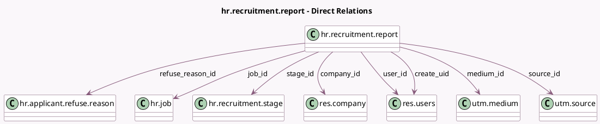

<!-- GENERATED:MODEL -->
---
tags: [odoo, enterprise, generated, model]
---

# hr.recruitment.report

- Module: [[docs/Enterprise Addons/hr_recruitment_reports/hr_recruitment_reports|hr_recruitment_reports]]
- Scope: Enterprise Addons
- Defined in module: yes
- Source files: `report/hr_recruitment_report.py`
- Python classes: `HrRecruitmentReport`
- Description: Recruitment Analysis Report

## Field footprint

- Detected fields: 19
- Field types: `Char` x 1, `Date` x 2, `Integer` x 7, `Many2one` x 8, `Selection` x 1
- Relation fields: 8

## Sample fields

- `company_id`: `Many2one` (comodel `res.company`)
- `count`: `Integer` (comodel `Applications`)
- `create_date`: `Date` (comodel `Application Date`)
- `create_uid`: `Many2one` (comodel `res.users`)
- `date_closed`: `Date` (comodel `End Date`)
- `hired`: `Integer` (comodel `Hired`)
- `hiring_ratio`: `Integer` (comodel `Hired Ratio`)
- `in_progress`: `Integer` (comodel `In Progress`)
- `job_id`: `Many2one` (comodel `hr.job`)
- `medium_id`: `Many2one` (comodel `utm.medium`)
- `meetings_amount`: `Integer` (comodel `Meetings`)
- `name`: `Char` (comodel `Applicant Name`)
- `process_duration`: `Integer` (comodel `Process Duration`)
- `refuse_reason_id`: `Many2one` (comodel `hr.applicant.refuse.reason`)
- `refused`: `Integer` (comodel `Refused`)
- `source_id`: `Many2one` (comodel `utm.source`)
- `stage_id`: `Many2one` (comodel `hr.recruitment.stage`)
- `state`: `Selection`
- `user_id`: `Many2one` (comodel `res.users`)

## Method hints

- Detected methods: 4
- Action methods: `action_open_applicant`
- Compute methods: none
- Onchange methods: none

## Direct relation diagram

## Navigation

- **Parent:** [[docs/Enterprise Addons/hr_recruitment_reports/Models]]

<!-- GENERATED:MODEL -->
