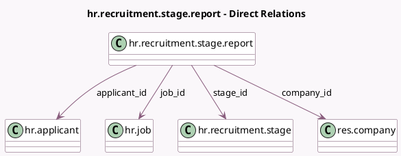

<!-- GENERATED:MODEL -->
---
tags: [odoo, enterprise, generated, model]
---

# hr.recruitment.stage.report

- Module: [[docs/Enterprise Addons/hr_recruitment_reports/hr_recruitment_reports|hr_recruitment_reports]]
- Scope: Enterprise Addons
- Defined in module: yes
- Source files: `report/hr_recruitment_stage_report.py`
- Python classes: `HrRecruitmentStageReport`
- Description: Recruitment Stage Analysis

## Field footprint

- Detected fields: 9
- Field types: `Char` x 1, `Date` x 2, `Float` x 1, `Many2one` x 4, `Selection` x 1
- Relation fields: 4

## Sample fields

- `applicant_id`: `Many2one` (comodel `hr.applicant`)
- `company_id`: `Many2one` (comodel `res.company`)
- `date_begin`: `Date` (comodel `Start Date`)
- `date_end`: `Date` (comodel `End Date`)
- `days_in_stage`: `Float`
- `job_id`: `Many2one` (comodel `hr.job`)
- `name`: `Char` (comodel `Applicant Name`)
- `stage_id`: `Many2one` (comodel `hr.recruitment.stage`)
- `state`: `Selection`

## Method hints

- Detected methods: 1
- Action methods: none
- Compute methods: none
- Onchange methods: none

## Direct relation diagram

## Navigation

- **Parent:** [[docs/Enterprise Addons/hr_recruitment_reports/Models]]

<!-- GENERATED:MODEL -->
