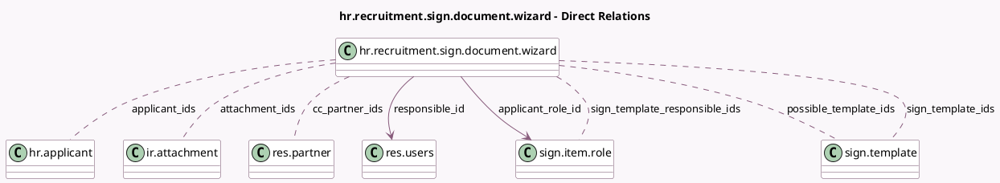

<!-- GENERATED:MODEL -->
---
tags: [odoo, enterprise, generated, model]
---

# hr.recruitment.sign.document.wizard

- Module: [[docs/Enterprise Addons/hr_recruitment_sign/hr_recruitment_sign|hr_recruitment_sign]]
- Scope: Enterprise Addons
- Defined in module: yes
- Source files: `wizard/hr_recruitment_sign_document_wizard.py`
- Python classes: `HrRecruitmentSignDocumentWizard`
- Description: Sign document in recruitment

## Field footprint

- Detected fields: 12
- Field types: `Boolean` x 1, `Char` x 2, `Html` x 1, `Many2many` x 6, `Many2one` x 2
- Relation fields: 8

## Sample fields

- `applicant_ids`: `Many2many` (comodel `hr.applicant`)
- `applicant_role_id`: `Many2one` (comodel `sign.item.role`, compute `_compute_applicant_role_id`, store `True`)
- `attachment_ids`: `Many2many` (comodel `ir.attachment`)
- `cc_partner_ids`: `Many2many` (comodel `res.partner`)
- `has_both_template`: `Boolean` (compute `_compute_has_both_template`)
- `message`: `Html` (comodel `Message`)
- `possible_template_ids`: `Many2many` (comodel `sign.template`, compute `_compute_possible_template_ids`)
- `responsible_id`: `Many2one` (comodel `res.users`)
- `sign_template_ids`: `Many2many` (comodel `sign.template`)
- `sign_template_responsible_ids`: `Many2many` (comodel `sign.item.role`, compute `_compute_responsible_ids`)
- `subject`: `Char`
- `template_warning`: `Char` (store `False`)

## Method hints

- Detected methods: 8
- Action methods: none
- Compute methods: `_compute_applicant_role_id`, `_compute_has_both_template`, `_compute_possible_template_ids`, `_compute_responsible_ids`
- Onchange methods: none

## Direct relation diagram

## Navigation

- **Parent:** [[docs/Enterprise Addons/hr_recruitment_sign/Models]]

<!-- GENERATED:MODEL -->
