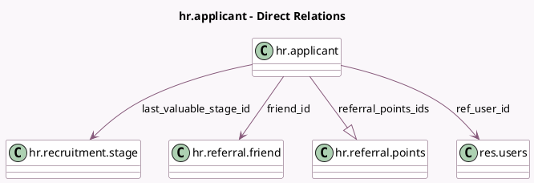

<!-- GENERATED:MODEL -->
---
tags: [odoo, enterprise, generated, model]
---

# hr.applicant

- Module: [[docs/Enterprise Addons/hr_referral/hr_referral|hr_referral]]
- Scope: Enterprise Addons
- Defined in module: extension only
- Source files: `models/hr_applicant.py`
- Python classes: `HrApplicant`

## Field footprint

- Detected fields: 10
- Field types: `Boolean` x 1, `Integer` x 2, `Many2one` x 4, `One2many` x 1, `Selection` x 1, `Text` x 1
- Relation fields: 5

## Sample fields

- `earned_points`: `Integer` (compute `_compute_earned_points`)
- `friend_id`: `Many2one` (comodel `hr.referral.friend`)
- `is_accessible_to_current_user`: `Boolean` (compute `_compute_is_accessible_to_current_user`)
- `last_valuable_stage_id`: `Many2one` (comodel `hr.recruitment.stage`)
- `max_points`: `Integer` (related `job_id.max_points`)
- `ref_user_id`: `Many2one` (comodel `res.users`, compute `_compute_ref_user_id`, store `True`)
- `referral_points_ids`: `One2many` (comodel `hr.referral.points`)
- `referral_state`: `Selection`
- `shared_item_infos`: `Text` (compute `_compute_shared_item_infos`)
- `source_id`: `Many2one` (compute `_compute_source_id`, store `True`)

## Method hints

- Detected methods: 22
- Action methods: none
- Compute methods: `_compute_earned_points`, `_compute_is_accessible_to_current_user`, `_compute_ref_user_id`, `_compute_shared_item_infos`, `_compute_source_id`
- Onchange methods: none

## Direct relation diagram

## Navigation

- **Parent:** [[docs/Enterprise Addons/hr_referral/Models]]

<!-- GENERATED:MODEL -->
