<!-- GENERATED:MODEL -->
---
tags: [odoo, enterprise, generated, model]
---

# hr.job

- Module: [[docs/Enterprise Addons/hr_referral/hr_referral|hr_referral]]
- Scope: Enterprise Addons
- Defined in module: extension only
- Source files: `models/hr_job.py`
- Python classes: `HrJob`

## Field footprint

- Detected fields: 7
- Field types: `Date` x 1, `Integer` x 5, `Many2one` x 1
- Relation fields: 1

## Sample fields

- `direct_clicks`: `Integer` (compute `_compute_clicks`)
- `facebook_clicks`: `Integer` (compute `_compute_clicks`)
- `job_open_date`: `Date` (comodel `Job Start Recruitment Date`)
- `linkedin_clicks`: `Integer` (compute `_compute_clicks`)
- `max_points`: `Integer` (compute `_compute_max_points`)
- `twitter_clicks`: `Integer` (comodel `X Clicks`, compute `_compute_clicks`)
- `utm_campaign_id`: `Many2one` (comodel `utm.campaign`)

## Method hints

- Detected methods: 7
- Action methods: `action_referral_campaign`, `action_share_external`
- Compute methods: `_compute_clicks`, `_compute_max_points`
- Onchange methods: none

## Direct relation diagram

```plantuml
@startuml
!define ODOO_COLOR_PRIMARY #714B67
!define ODOO_COLOR_ACCENT #875A7B
!define ODOO_COLOR_BG #FAF7FA

skinparam backgroundColor ODOO_COLOR_BG
skinparam defaultTextAlignment left
skinparam ArrowColor ODOO_COLOR_ACCENT
skinparam ClassBackgroundColor white
skinparam ClassBorderColor ODOO_COLOR_PRIMARY
skinparam ComponentBackgroundColor white
skinparam ComponentBorderColor ODOO_COLOR_PRIMARY
skinparam NoteBackgroundColor #FFF8FF
skinparam NoteBorderColor ODOO_COLOR_ACCENT
skinparam SequenceLifeLineBorderColor ODOO_COLOR_ACCENT
skinparam SequenceLifeLineBackgroundColor #FFFFFF
skinparam SequenceParticipantBorderColor ODOO_COLOR_PRIMARY
skinparam SequenceParticipantBackgroundColor #FFFFFF
skinparam sequence {
  ArrowColor ODOO_COLOR_ACCENT
  ActorBorderColor ODOO_COLOR_PRIMARY
}
title hr.job - Direct Relations
class "hr.job" as hr_job
class "utm.campaign" as utm_campaign
hr_job --> utm_campaign : utm_campaign_id
@enduml
```

## Navigation

- **Parent:** [[docs/Enterprise Addons/hr_referral/Models]]

<!-- GENERATED:MODEL -->
