<!-- GENERATED:MODEL -->
---
tags: [odoo, enterprise, generated, model]
---

# hr.referral.alert.mail.wizard

- Module: [[docs/Enterprise Addons/hr_referral/hr_referral|hr_referral]]
- Scope: Enterprise Addons
- Defined in module: yes
- Source files: `wizard/hr_referral_alert_mail_wizard.py`
- Python classes: `HrReferralAlertMailWizard`
- Description: Referral Alert Mail Wizard

## Field footprint

- Detected fields: 3
- Field types: `Char` x 1, `Html` x 1, `Many2many` x 1
- Relation fields: 1

## Sample fields

- `body`: `Html`
- `subject`: `Char`
- `user_ids`: `Many2many` (comodel `res.users`, store `False`)

## Method hints

- Detected methods: 4
- Action methods: `action_send`
- Compute methods: none
- Onchange methods: none

## Direct relation diagram

```plantuml
@startuml
!define ODOO_COLOR_PRIMARY #714B67
!define ODOO_COLOR_ACCENT #875A7B
!define ODOO_COLOR_BG #FAF7FA

skinparam backgroundColor ODOO_COLOR_BG
skinparam defaultTextAlignment left
skinparam ArrowColor ODOO_COLOR_ACCENT
skinparam ClassBackgroundColor white
skinparam ClassBorderColor ODOO_COLOR_PRIMARY
skinparam ComponentBackgroundColor white
skinparam ComponentBorderColor ODOO_COLOR_PRIMARY
skinparam NoteBackgroundColor #FFF8FF
skinparam NoteBorderColor ODOO_COLOR_ACCENT
skinparam SequenceLifeLineBorderColor ODOO_COLOR_ACCENT
skinparam SequenceLifeLineBackgroundColor #FFFFFF
skinparam SequenceParticipantBorderColor ODOO_COLOR_PRIMARY
skinparam SequenceParticipantBackgroundColor #FFFFFF
skinparam sequence {
  ArrowColor ODOO_COLOR_ACCENT
  ActorBorderColor ODOO_COLOR_PRIMARY
}
title hr.referral.alert.mail.wizard - Direct Relations
class "hr.referral.alert.mail.wizard" as hr_referral_alert_mail_wizard
class "res.users" as res_users
hr_referral_alert_mail_wizard .. res_users : user_ids
@enduml
```

## Navigation

- **Parent:** [[docs/Enterprise Addons/hr_referral/Models]]

<!-- GENERATED:MODEL -->
