<!-- GENERATED:MODEL -->
---
tags: [odoo, enterprise, generated, model]
---

# hr.referral.campaign.wizard

- Module: [[docs/Enterprise Addons/hr_referral/hr_referral|hr_referral]]
- Scope: Enterprise Addons
- Defined in module: yes
- Source files: `wizard/hr_referral_campaign_wizard.py`
- Python classes: `HrReferralCampaignWizard`
- Description: Referral Campaign Wizard
- Inherits: `hr.mixin`

## Field footprint

- Detected fields: 6
- Field types: `Boolean` x 1, `Char` x 1, `Html` x 1, `Many2many` x 1, `Many2one` x 1, `Selection` x 1
- Relation fields: 2

## Sample fields

- `employee_ids`: `Many2many` (comodel `hr.employee`, store `True`)
- `is_published`: `Boolean` (related `job_id.is_published`)
- `job_id`: `Many2one` (comodel `hr.job`)
- `mail_body`: `Html` (compute `_compute_mail_body`, store `True`)
- `mail_subject`: `Char` (compute `_compute_mail_subject`, store `True`)
- `target`: `Selection`

## Method hints

- Detected methods: 7
- Action methods: `action_send`
- Compute methods: `_compute_mail_body`, `_compute_mail_subject`
- Onchange methods: none

## Direct relation diagram

```plantuml
@startuml
!define ODOO_COLOR_PRIMARY #714B67
!define ODOO_COLOR_ACCENT #875A7B
!define ODOO_COLOR_BG #FAF7FA

skinparam backgroundColor ODOO_COLOR_BG
skinparam defaultTextAlignment left
skinparam ArrowColor ODOO_COLOR_ACCENT
skinparam ClassBackgroundColor white
skinparam ClassBorderColor ODOO_COLOR_PRIMARY
skinparam ComponentBackgroundColor white
skinparam ComponentBorderColor ODOO_COLOR_PRIMARY
skinparam NoteBackgroundColor #FFF8FF
skinparam NoteBorderColor ODOO_COLOR_ACCENT
skinparam SequenceLifeLineBorderColor ODOO_COLOR_ACCENT
skinparam SequenceLifeLineBackgroundColor #FFFFFF
skinparam SequenceParticipantBorderColor ODOO_COLOR_PRIMARY
skinparam SequenceParticipantBackgroundColor #FFFFFF
skinparam sequence {
  ArrowColor ODOO_COLOR_ACCENT
  ActorBorderColor ODOO_COLOR_PRIMARY
}
title hr.referral.campaign.wizard - Direct Relations
class "hr.referral.campaign.wizard" as hr_referral_campaign_wizard
class "hr.employee" as hr_employee
class "hr.job" as hr_job
hr_referral_campaign_wizard --> hr_job : job_id
hr_referral_campaign_wizard .. hr_employee : employee_ids
@enduml
```

## Navigation

- **Parent:** [[docs/Enterprise Addons/hr_referral/Models]]

<!-- GENERATED:MODEL -->
