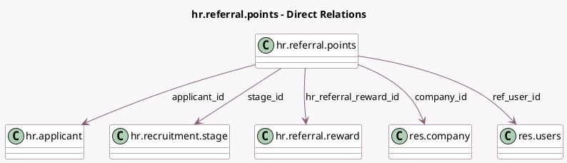

<!-- GENERATED:MODEL -->
---
tags: [odoo, enterprise, generated, model]
---

# hr.referral.points

- Module: [[docs/Enterprise Addons/hr_referral/hr_referral|hr_referral]]
- Scope: Enterprise Addons
- Defined in module: yes
- Source files: `models/hr_referral_points.py`
- Python classes: `HrReferralPoints`
- Description: Points line for referrals

## Field footprint

- Detected fields: 8
- Field types: `Char` x 1, `Integer` x 2, `Many2one` x 5
- Relation fields: 5

## Sample fields

- `applicant_id`: `Many2one` (comodel `hr.applicant`)
- `applicant_name`: `Char` (related `applicant_id.partner_name`)
- `company_id`: `Many2one` (comodel `res.company`)
- `hr_referral_reward_id`: `Many2one` (comodel `hr.referral.reward`)
- `points`: `Integer` (comodel `Points`)
- `ref_user_id`: `Many2one` (comodel `res.users`)
- `sequence_stage`: `Integer` (comodel `Sequence of stage`, related `stage_id.sequence`)
- `stage_id`: `Many2one` (comodel `hr.recruitment.stage`)

## Method hints

- Detected methods: 1
- Action methods: none
- Compute methods: `_compute_display_name`
- Onchange methods: none

## Direct relation diagram

## Navigation

- **Parent:** [[docs/Enterprise Addons/hr_referral/Models]]

<!-- GENERATED:MODEL -->
